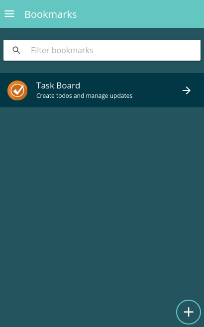

===================
DashboardTopButtons
===================
Display buttons on big screens on the top right, used to be included remotly into the dapp-wrapper top bar.

Use the "on-small-move-down" class to move it automtically to the bottom right corner of the screen. Within this component ion-searchbars will be hidden on small devices, so you can easily create dynamic scaled top bar elements.

-------
Example
-------
Reference Implementation: `Favorites DApp <https://github.com/evannetwork/core-dapps/blob/develop/dapps/favorites/src/components/dapp-list/dapp-list.html>`_

::

  <dashboard-top-buttons class="on-small-move-down">
    <ion-searchbar 
      placeholder="{{ '_dappdapps.filter_items' | translate }}" 
      [(ngModel)]="filterString"
      (ionInput)="filter($event)">
    </ion-searchbar>

    <button ion-button icon-left outline routerLink="./dapp-add">
      <ion-icon name="add"></ion-icon>
      {{ '_dappdapps.add' | translate }}
    </button>
  </dashboard-top-buttons>
  
  <ion-searchbar 
    placeholder="{{ '_dappdapps.filter_items' | translate }}" 
    [(ngModel)]="filterString"
    (ionInput)="filter($event)">
  </ion-searchbar>

------------
View Example
------------

- big screens

- small screens

