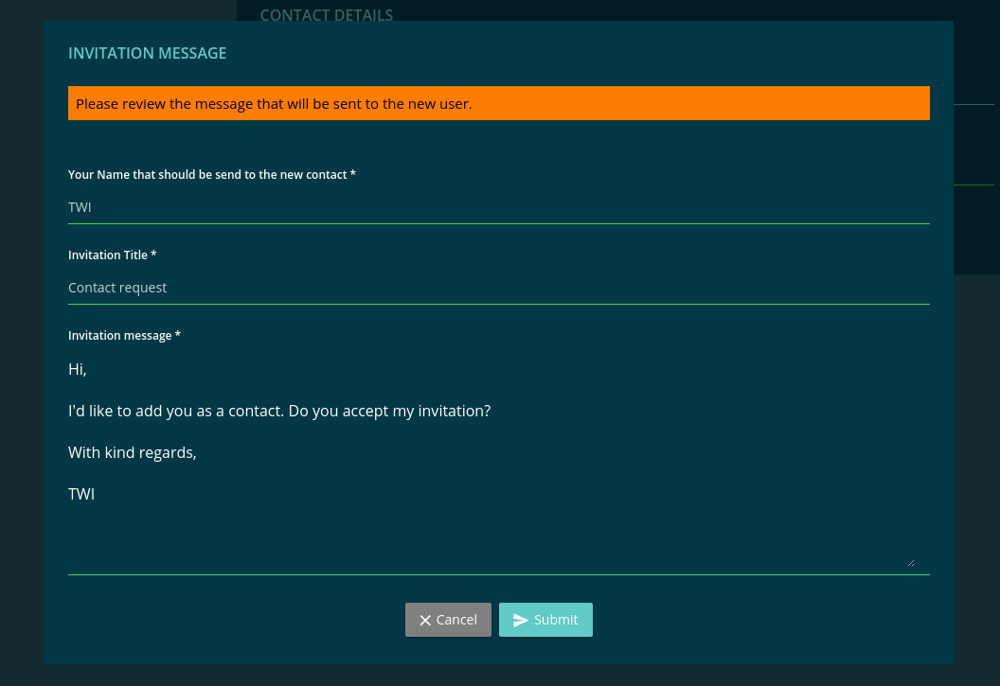

===================
MailDialogComponent
===================

Used within an modal to enable the user to edit a mail, before it's send.

-------
Example
-------
Reference Implementation: `Addressbook DApp detail <https://github.com/evannetwork/ui-core-dapps/blob/develop/dapps/addressbook/src/components/account-detail/account-detail.ts>`_

- typescript

.. code-block:: typescript

    mail = await this.mailboxService
      .showMailModal(
        this.modalService,
        '_dappcontacts.invitation-message',
        '_dappcontacts.invitation-message-long',
        '_dappcontacts.invitation-text.title',
        '_dappcontacts.invitation-text.body',
      );

    formData.accountId = formData.accountId || this.accountId || formData.email;

    this.addressBookService.addContactToQueue(formData.accountId, {
      isCreate: this.isCreate,
      profile: formData,
      mail: mail
    });

------------
View Example
------------

