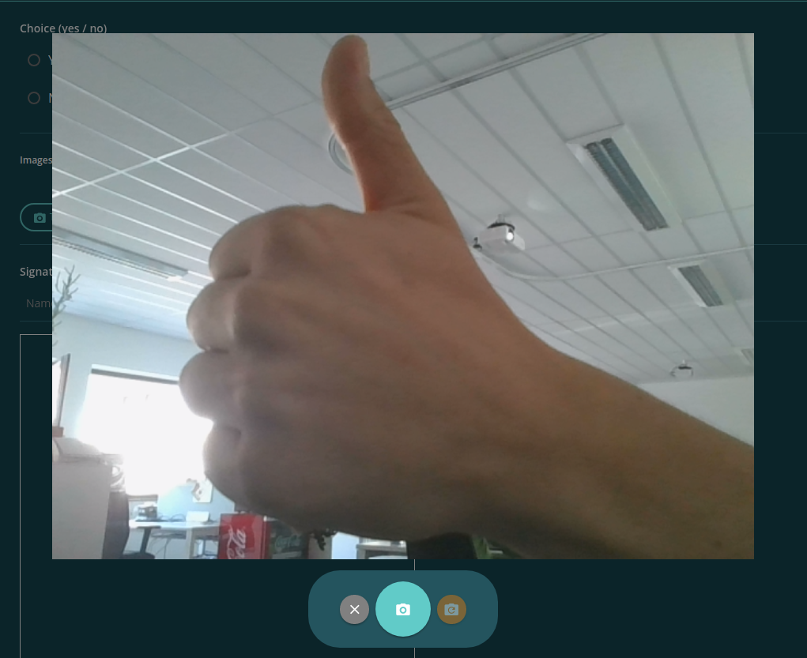

=======================
SnapshotDialogComponent
=======================

Component to take pictures using HTML 5. Should only be used within a modal.

-------
Example
-------
Reference Implementation: `EvanPictureService <https://github.com/evannetwork/angular-core/blob/develop/src/services/ui/picture.ts>`_

- typescript

.. code-block:: typescript

  import {
    EvanModalService,
  } from 'angular-core';

  constructor(
    private modalService: EvanModalService,
  ) { }

  ngOnInit() {
    this.picture = await this.modalService.createModal(SnapshotDialogComponent, {});
  }

  openPictureDetail(dataUrl) {
    try {
      return this.modalService.showBigPicture(
        'alertTitle',
        'alertText',
        dataUrl,
      );
    } catch (ex) { }
  }

- html

::

  

------------
View Example
------------

