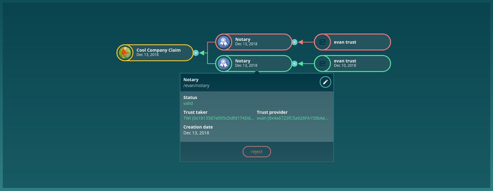

==================
EvanVerificationComponent
==================

.. list-table:: 
   :widths: auto
   :stub-columns: 1

   * - Source
     - `verification <https://github.com/evannetwork/ui-angular-core/blob/develop/src/components/verification>`__

Display a all verifications for a specific topic using the api-blockchain-core verifications service.

------
Inputs
------
#. ``address`` - ``string``: address that for that the verifications should be checked
#. ``topic`` - ``string``: the topic to load the verifications for (/test/test2)
#. ``mode`` - ``string``: display mode that should be used (minimal, detail, full)
#. ``compute`` - ``boolean``: use computed view and only one verification instead of all possible ones (will display a small verification count at the right of the card)
#. ``enableIssue`` - ``boolean``: Are issue buttons are available? Not avaialble for icon mode
#. ``enableDelete`` - ``boolean``: should the delete button be shown?
#. ``enableReject`` - ``boolean``: should the delete button be shown?

-------
Example
-------
Reference Implementation: `Profile Verifications Component <https://github.com/evannetwork/ui-angular-core/tree/develop/src/components/profile-verifications>`_

::

  <evan-verification
    [topic]="'/test/1234'"
    [address]="'0x1291781...'"
    [mode]="'icon'"
    [compute]="true">
  </evan-verification>

------------
View Example
------------

