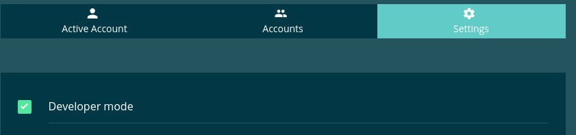
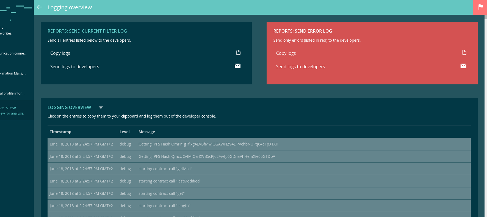

===============
EvanUtilService
===============

Utility service for the whole angular core module.

- ``devMode`` - ``boolean``: is |source devMode|_ enabled?
- ``isXXL`` - ``boolean``: is browser width greater than 1500?
- ``isXL`` - ``boolean``: is browser width greater than 1200?
- ``isLG`` - ``boolean``: is browser width greater than 992?
- ``isMD`` - ``boolean``: is browser width greater than 768?
- ``isSM`` - ``boolean``: is browser width greater than 576?
- ``screenSize`` - ``number``: current window size
- ``logger`` - ``Logger``: |source logger|_ instance

.. |source devMode| replace:: ``devMode``
.. _source devMode: ../../dapp-browser/utils.html#devmode

.. |source logger| replace:: ``BCC logger``
.. _source logger: https://github.com/evannetwork/api-blockchain-core/blob/develop/docs/common/logger.rst

--------------------------------------------------------------------------------

fillDevEnvVariables
================================================================================

.. code-block:: typescript

  fillDevEnvVariables(full);

Prefill localStorage dev environment variables, so they can easily accessed by developers. ('angular-dev-logs', 'bc-dev-logs',)
Without passing the "full" parameter only this variables will be filled:

- ``angular-dev-logs``: enable logs for frontend debug logs
- ``bc-dev-logs``: enable log for blockchain-core dev logs

By using the full parameter, all availabe configuration parameters will be empty applied to localStorage:

- ``evan-account``: current account is saved here to access it globally without any service
- ``evan-bc-root``: blockchain-core configuration for default business center
- ``evan-ens-address``: blockchain-core configuration for the ens address
- ``evan-ens-events``: blockchain-core configuration for ens eventhub address
- ``evan-ens-mailbox``: blockchain-core configuration for ens mailbox address
- ``evan-ens-profiles``: blockchain-core configuration for ens profile address
- ``evan-ens-resolver``: blockchain-core configuration for ens contract resolver address
- ``evan-ens-root``: blockchain-core configuration for root ens (default = 'evan') 
- ``evan-language``: overwrite the current used language (values: 'en', 'de', 'fr')
- ``evan-mail-read``: list of mail address that were readed by the user 
- ``evan-mail-read-count``: amount of mails that the user readed
- ``evan-profile-creation``: check if the user is within the profile creation, used to navigate again to onboarding when the user reloads the page during profile creation
- ``evan-provider``: current used login provider (internal / external)
- ``evan-small-toolbar``: check if the evan-split-pane component is within the small view
- ``evan-terms-of-use``: has the user accepted the terms of use? (only for local checking, is also saved within blockchain)
- ``evan-test-password``: password that is used for testing, user gets automatically logged with this password.
  
  - DANGER: should not be used in production, its a big security leak by passing clear text passwords to localStorage 

- ``evan-vault``: encrypted vault of the current logged in user
- ``evan-web3-provider``: overwrite web3 connection url (default is 'wss://testcore.evan.network/ws')
 
----------
Parameters
----------

#. ``full`` - ``object`` (optional): check if all internal variables should enrolled too

-------
Example
-------

.. code-block:: typescript

  utilService.fillDevEnvVariables(true);

--------------------------------------------------------------------------------

addTemporaryStyle
================================================================================

.. code-block:: typescript

  utilService.addTemporaryStyle(name, css);

Add a temporary css style to the document head. E.g. it is used to style an image within an alert dialog.

----------
Parameters
----------

#. ``name`` - ``string``: Name for the style. Style is available under class : evan-img-${name}
#. ``css`` - ``string``: css definition

-------
Example
-------

.. code-block:: typescript

  this.utils.addTemporaryStyle(trimmedName, `
    .evan-temporary-${trimmedName} {
      min-width: 257px;
    }

    .evan-temporary-${trimmedName} .alert-img-container {
      background-color: ${primaryColor};
    }

    .evan-temporary-${trimmedName} .alert-img-container .alert-img {
      background-color: ${secondaryColor};
      background-image: url("${definition.imgSquare}");
    }
  `);

--------------------------------------------------------------------------------

.. removeTemporaryImageStyle:

removeTemporaryImageStyle
================================================================================

.. code-block:: typescript

  utilService.removeTemporaryImageStyle(name);

Remove a temporary style sheet from the dom.

----------
Parameters
----------

#. ``name`` - ``string``: Name for the style. Style is available under ID : evan-img-${name}

-------
Example
-------

.. code-block:: typescript

  this.utilService.removeTemporaryImageStyle(name);

--------------------------------------------------------------------------------

isMobile
================================================================================

.. code-block:: typescript

  utilService.isMobile();

Check if we are on a mobile device (no matter if ionic app or browser).

-------
Returns
-------

``boolean``: True if mobile, False otherwise.

--------------------------------------------------------------------------------

isNativeMobile
================================================================================

.. code-block:: typescript

  utilService.isNativeMobile();

Check if we are on a mobile device (check if cordova is available).

-------
Returns
-------

``boolean``: True if native mobile, False otherwise.

--------------------------------------------------------------------------------

isMobileIOS
================================================================================

.. code-block:: typescript

  utilService.isMobileIOS();

check if we are on a ios mobile device (no matter if ionic app or browser).

-------
Returns
-------

``boolean``: True if mobile ios, False otherwise.

--------------------------------------------------------------------------------

isMobileAndroid
================================================================================

.. code-block:: typescript

  utilService.isMobileAndroid();

check if we are on a android mobile device (no matter if ionic app or browser).

-------
Returns
-------

``boolean``: True if mobile android, False otherwise.

--------------------------------------------------------------------------------

timeout
================================================================================

.. code-block:: typescript

  utilService.timeout(ms);

Promise wrapper for setTimeout.

----------
Parameters
----------

#. ``ms`` - ``number``: Milliseconds to wait

-------
Returns
-------

``Promise`` returns ``void``: resolved when timeout is done

-------
Example
-------

.. code-block:: typescript

  await this.utilService.timeout(500);

--------------------------------------------------------------------------------

immediate
================================================================================

.. code-block:: typescript

  utilService.timeout();

Promise wrapper for setimmediate.

-------
Returns
-------

``Promise`` returns ``void``: solved when setImmediate callback is called

-------
Example
-------

.. code-block:: typescript

  await this.utilService.immediate();

--------------------------------------------------------------------------------

uniqueArray
================================================================================

.. code-block:: typescript

  utilService.uniqueArray(a);

Remove duplicate values from an array.

----------
Parameters
----------

#. ``a`` - ``Array<any>``: Input Array

-------
Returns
-------

``Array<any>``: the unique array

-------
Example
-------

.. code-block:: typescript

  this.utilService.uniqueArray(['a', 'a', 'b', 'a', 'c', 'd', 'b'])

**Will result: a, b, c, d**

--------------------------------------------------------------------------------

windowSize
================================================================================

.. code-block:: typescript

  await utilSerivce.windowSize(callback);

Registers and window resize watcher

----------
Parameters
----------

#. ``callback`` - ``Function``: callback is called when size has changed and one time by calling the function directly

-------
Returns
-------

``Promise`` returns ``Function``: Function to unsubscribe after the callback function was called the first time

-------
Example
-------

.. code-block:: typescript

  const unsubscribe = await utilService.windowSize((width) => {
    console.log(width);
  })

  setTimeout(() => unsubscribe());

--------------------------------------------------------------------------------

sendEvent
================================================================================

.. code-block:: typescript

  utilsService.sendEvent(name, data);

emits a window.dispatchEvent

----------
Parameters
----------

#. ``name`` - ``object``: even name
#. ``data`` - ``Function`` (optional): data to send

-------
Example
-------

.. code-block:: typescript

  // will open side panel on small devices
  utilService.sendEvent('toggle-split-pane')

--------------------------------------------------------------------------------

onEvent
================================================================================

.. code-block:: typescript

  utilService.onEvent(name, func);

runs window.addEventListener and func is called when event was triggered

----------
Parameters
----------

#. ``name`` - ``object``: event name
#. ``func`` - ``Function``: function that is called on event occurence

-------
Returns
-------

``Function``: Function to unsubscribe

-------
Example
-------

.. code-block:: typescript

  utilService.onEvent('toggle-split-pane', () => {
    console.log('side panel was toggled');
  });

--------------------------------------------------------------------------------

deepCopy
================================================================================

.. code-block:: typescript

  utilService.deepCopy(arguments);

Runs JSON.parse(JSON.stringify(obj)) to make an maximum deep copy. Be

**Beaware: dont apply recursive objects!**

----------
Parameters
----------

#. ``obj`` - ``object``: object that should be cloned

-------
Returns
-------

``any``: cloned object

-------
Example
-------

.. code-block:: typescript

  x = { a: 1, b: 2, c: 3 }
  y = utilService.deepCopy(x);

  y.a = 4;
  y.b = 5;
  y.c = 6;

  console.log(x) // => { a: 1, b: 2, c: 3 }
  console.log(y) // => { a: 4, b: 5, c: 6 }

--------------------------------------------------------------------------------

getParentByClassName
================================================================================

.. code-block:: typescript

  utilService.getParentByClassName(element, className);

Searches relative to an element an parent element with a specific element class

----------
Parameters
----------

#. ``element`` - ``any``: reference element
#. ``className`` - ``string``: class name that should be searched

-------
Returns
-------

``Element``: parent element that should be searched

-------
Example
-------

::

  

    

      

    

  

.. code-block:: typescript

  const mainElement = document.getElementById('mainElement');  
  const parent = utilService.getParentByClassName(mainElement, 'im-a-parent');

--------------------------------------------------------------------------------

getOffsetTop
================================================================================

.. code-block:: typescript

  utilService.getOffsetTop($parent, $element, offsetTop);

Gets the full offset top of an element relative to an container

----------
Parameters
----------

#. ``$parent`` - ``Element``: Parent container where the offset of the child should be get
#. ``$element`` - ``any``: Element to retrieve offset top from
#. ``offsetTop`` - ``number`` (default = 0): last offset top for recursive function

-------
Returns
-------

``number``: offset

-------
Example
-------
::

  

    

      

    

  

.. code-block:: typescript

  const mainElement = document.getElementById('mainElement');  
  const parent = utilService.getParentByClassName(mainElement, 'im-a-parent');

  const offset = utilService.getOffsetTop(parent, mainElement);

--------------------------------------------------------------------------------

scrollTo
================================================================================

.. code-block:: typescript

  utilService.scrollTo($container, direction, scrollTo);

Scroll a container horizontal / vertical smooth to a specific position

----------
Parameters
----------

#. ``$container`` - ``Element``: element that should be scrolled
#. ``direction`` - ``string``: horizontal / vertical
#. ``scrollTo`` - ``number``: position to scroll to

-------
Example
-------

.. code-block:: typescript

  // scroll to most top position
  utilService.scrollTo(container, 'horizontal', 0);

--------------------------------------------------------------------------------

scrollUp
================================================================================

.. code-block:: typescript

  utilService.scrollUp($container, scrollTo, maxTurns);

Scrolls the suggestions container upwards

----------
Parameters
----------

#. ``$container`` - ``Element``: $$container that should be scrolled
#. ``scrollTo`` - ``number``: where the container should be scrolled to
#. ``maxTurns`` - ``number`` (default): max turns to break animation (max. 200px)

-------
Example
-------

.. code-block:: typescript

  // scroll to most top position
  utilService.scrollUp(container, 0);

--------------------------------------------------------------------------------

scrollDown
================================================================================

.. code-block:: typescript

  utilService.scrollDown($container, scrollTo, maxTurns);

Scrolls the suggestions container downwards

----------
Parameters
----------

#. ``$container`` - ``Element``: $$container that should be scrolled
#. ``scrollTo`` - ``number``: where the container should be scrolled to
#. ``maxTurns`` - ``number`` (default): max turns to break animation (max. 200px)

-------
Example
-------

.. code-block:: typescript

  // scroll to most top position
  utilService.scrollDown(container, 500);

--------------------------------------------------------------------------------

scrollLeft
================================================================================

.. code-block:: typescript

  utilService.scrollLeft($container, scrollTo, maxTurns);

Scrolls the suggestions container to the left.

----------
Parameters
----------

#. ``$container`` - ``Element``: $$container that should be scrolled
#. ``scrollTo`` - ``number``: where the container should be scrolled to
#. ``maxTurns`` - ``number`` (default): max turns to break animation (max. 200px)

-------
Example
-------

.. code-block:: typescript

  // scroll to most top position
  utilService.scrollLeft(container, 500);

--------------------------------------------------------------------------------

scrollRight
================================================================================

.. code-block:: typescript

  utilService.scrollRight($container, scrollTo, maxTurns);

Scrolls the suggestions container to the right.

----------
Parameters
----------

#. ``$container`` - ``Element``: $$container that should be scrolled
#. ``scrollTo`` - ``number``: where the container should be scrolled to
#. ``maxTurns`` - ``number`` (default): max turns to break animation (max. 200px)

-------
Example
-------

.. code-block:: typescript

  // scroll to most top position
  utilService.scrollRight(container, 500);

--------------------------------------------------------------------------------

.. _document_generateID:

generateID
================================================================================

.. code-block:: typescript

  utilService.generateID();

Generates an uid.

-------
Returns
-------

``string``: uuid (257bed80-d18a-1a70-5e9b-fb4d3afa8915)

--------------------------------------------------------------------------------

.. _document_log:

log
================================================================================

.. code-block:: typescript

  utilService.log(message, level);

Using BCC log function to handle a generalized loggin mechanism.

----------
Parameters
----------

#. ``message`` - ``object``: message to log
#. ``level`` - ``Function``: level to log the message with

-------
Example
-------

.. code-block:: typescript

  this.utilService.log('hello world', 'debug')

--------------------------------------------------------------------------------

.. _document_isDeveloperMode:

isDeveloperMode
================================================================================

.. code-block:: typescript

  utilSerivce.isDeveloperMode(arguments);

Check if the user enabled developer mode within profile configuration. Can be enabled using the profile DApp under settings. It opens the following functionalities:

- enable logging & reporting DApp

-------
Returns
-------

``boolean``: True if developer mode, False otherwise.

-------
Example
-------

.. code-block:: typescript

  const isDeveloperMode = utilService.isDeveloperMode();

--------------------------------------------------------------------------------

.. _document_isDeveloperMode:

getErrorLog
================================================================================

.. code-block:: typescript

  utilSerivce.getErrorLog(ex);

Transforms an Exception into an loggable string format. Returns the string if the exception is only a string.

-------
Returns
-------

``string``: Transformed exception

-------
Example
-------

.. code-block:: typescript

  try {
    throw new Error('Exception');
  } catch (ex) {
    this.core.utils.log(`Error : ${ this.utils.getErrorLog(ex) }`, 'error');
  }