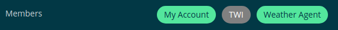
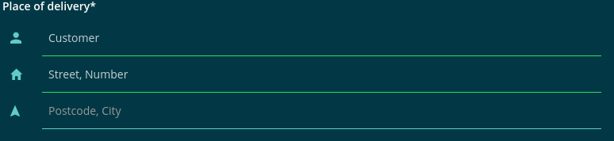

==============
Forms & Inputs
==============

Some specific styles for inputs.

.evan-tag-container
===================

-------
Example
-------
Reference Implementation: `Angular-core Contract Mbembers Component <https://github.com/evannetwork/ui-angular-core/blob/develop/src/components/contract-members/contract-members.html>`_

::

  

    

      {{ members.concat(origin).length }} {{ '_angularcore.contract-members.members' | translate }}
      <ng-container *ngIf="members.length > 0">
        , {{ '_angularcore.contract-members.new-members' | translate:{ count: members.length } }}
      </ng-container>
    

    

      
        {{ '_angularcore.contract-members.i' | translate }}
      

      
        {{ contacts[member]?.alias || contacts[member]?.email || member }}
      

      <ion-icon name="close"
        (click)="removeMember(member)"
        *ngIf="origin.indexOf(member) === -1 && getMemberState(member) !== 'loading'">
      </ion-icon>

      <ion-spinner name="close" color="primary" *ngIf="getMemberState(member) === 'loading'">
      </ion-spinner>
    

  

------------
View Example
------------

.input-error
============
Used within ion-item elements to shwo an validation error.

::

  <ion-item>...</ion-item>
  

    Info
  

.input-hint
===========
Used within ion-item elements to shwo an validation info.

::

  <ion-item>...</ion-item>
  

    Info
  

.group-icon-form
================
Uses ion-label's and ion-inputs's to create one grouped form layout for e.g. users address input.

::

  <ion-col col-12 col-md class="group-icon-form">
  <ion-label class="standalone">
    {{ 'place-of-delivery' | translate }}*
  </ion-label>
  <ion-item>
    <ion-label color="primary">
      <ion-icon name="person"></ion-icon>
    </ion-label>
    <ion-input required="true"
      [(ngModel)]="detail.customer"
      [placeholder]="'customer' | translate">
    </ion-input>
  </ion-item>
  <ion-item>
    <ion-label color="primary">
      <ion-icon name="home"></ion-icon>
    </ion-label>
    <ion-input required="true"
      [(ngModel)]="detail.street"
      [placeholder]="'street' | translate">
    </ion-input>
  </ion-item>
  <ion-item>
    <ion-label color="primary">
      <ion-icon name="navigate"></ion-icon>
    </ion-label>
    <ion-input pattern="[0-9]{5},(.*)" required="true"
      [(ngModel)]="detail.city"
      [placeholder]="'city-plz' | translate">
    </ion-input>
  </ion-item>

------------
View Example
------------

