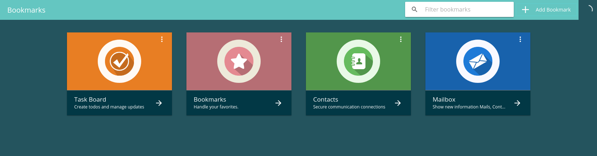
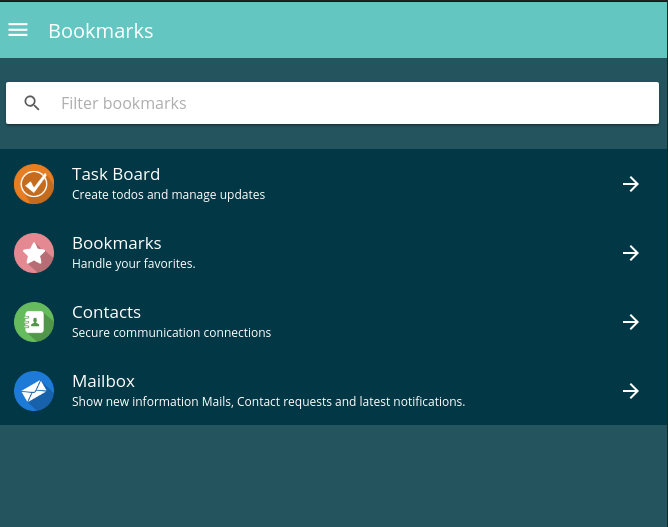

==========
Grid Lists
==========

Display ion-item's within `ion-lists <https://ionicframework.com/docs/components/#lists>`_ as cards on big screens and as normal list entries on small devices.

-------
Example
-------
- Reference Implementation: `Favorites DApp - DApp list component <https://github.com/evannetwork/core-dapps/blob/develop/dapps/favorites/src/components/dapp-list/dapp-list.html>`_

::

  <ion-list class="evan-grid" *ngIf="!loading">
    <ion-item-sliding *ngFor="let dapp of dappKeys" #sliding>
      <ion-item color="light">
        <ion-avatar class="clickable" item-start 
          [style.background-color]="dapps[dapp].primaryColor"
          (click)="openDApp(dapp)">
          

            <ng-container *ngIf="dapps[dapp].imgSquare">
              
            </ng-container>
          

        </ion-avatar>
        <ion-label class="clickable" (click)="openDApp(dapp)">
          <h2 *ngIf="!dapps[dapp].translated.name">{{ '_dappdapps.no_title' | translate }}</h2>
          <h2 *ngIf="dapps[dapp].translated.name">{{ dapps[dapp].translated.name }}</h2>
          <h3>{{ dapps[dapp].translated.description }}</h3>
        </ion-label>
        

          <button ion-button clear round item-end (click)="openDApp(dapp)">
            <ion-icon name="arrow-forward" color="light"></ion-icon>
          </button>
        

      </ion-item>
    </ion-item-sliding>
  </ion-list>

------------
View Example
------------

- big screens

-small screens

