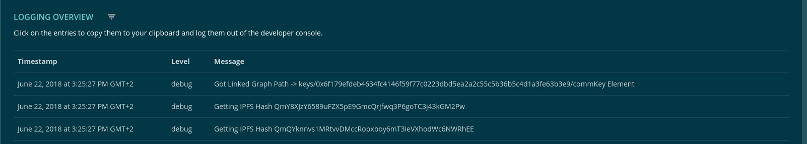

======
Tables
======

Tables are simply and dont need any classes. Only for a responsive design, you should wrap your table within a ".table-responsive" class, to handle small screen overflow.

-------
Example
-------

- Reference Implementation: `Logging DApp <https://github.com/evannetwork/ui-core-dapps/blob/develop/dapps/logging/src/components/logging/logging.html>`_

::

  

    <h2 class="content-header m-t-0 display-inline-block">{{ 'logging' | translate }}</h2>
    <ion-icon class="clickable" margin-left name="funnel" (click)="toggleFilters()"></ion-icon>
    
    
{{ '_logging.click-to-log' | translate }}

    

      <table class="table table-hover">
        <thead>
          <tr>
            <th>{{ '_logging.timestamp' | translate }}</th>
            <th>{{ '_logging.level' | translate }}</th>
            <th>{{ '_logging.message' | translate }}</th>
          </tr>
        </thead>
        <tbody>
          <tr *ngFor="let log of logs"
            [ngClass]="'level-' + log.level"
            (click)="logSingleLog(log)">
            <td>{{ log.timestamp | date:'long':'':translateService.translate.currentLang }}</td>
            <td>{{ log.level }}</td>
            <td>{{ log.message }}</td>
          </tr>
        </tbody>
      </table>
    

  

------------
View Example
------------

