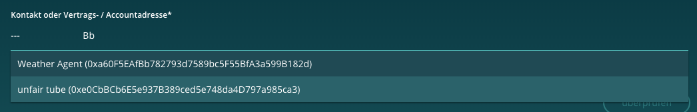

=====================
AddressInputComponent
=====================

.. list-table:: 
   :widths: auto
   :stub-columns: 1

   * - Source
     - `big-picture <https://github.com/evannetwork/ui-angular-core/blob/develop/src/components/address-input>`__

Component to select an account or contract address. For autocompletion processes, the addressbook of the current user is used. But also wildcard addresses can be inserted.

-------
Example
-------
Reference Implementation: `Verifications DApp <https://github.com/evannetwork/ui-core-dapps/blob/develop/dapps/verifictions/src/components/verifications/verifications.html>`_

- html

  ::

    <evan-address-input name="subject" #subjectSelectComp
      [(ngModel)]="subjectInput"
      [label]="('_verifications.subject.title' | translate) + '*'"
      [placeholder]="'_verifications.subject.desc' | translate"
      (onChange)="ref.detectChanges()">
    </evan-address-input>
    <ion-chip class="error-hint" *ngIf="subjectSelectComp.touched && !isValidAddress(subjectInput)" color="danger">
      <ion-label>{{ '_verifications.subject.error' | translate }}</ion-label>
    </ion-chip>

------------
View Example
------------

