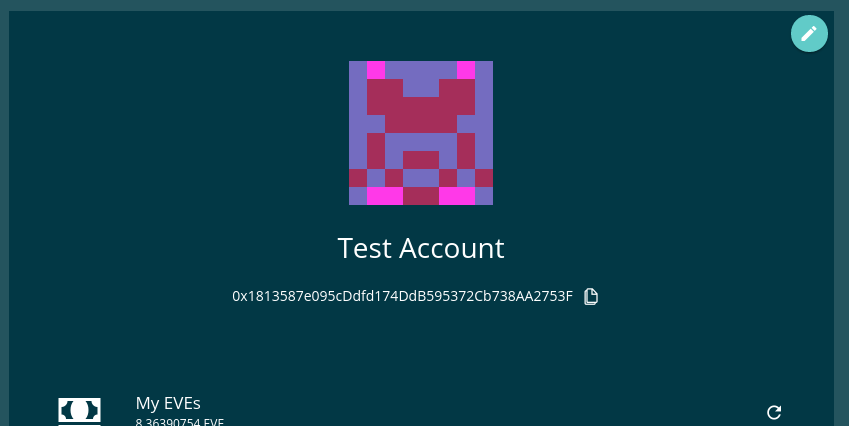

================
BlockieComponent
================

.. list-table:: 
   :widths: auto
   :stub-columns: 1

   * - Source
     - `blockie <https://github.com/evannetwork/ui-angular-core/blob/develop/src/components/blockie>`__

Displays account ids in blockie style. Angular component wrapper for `blockies <https://github.com/download13/blockies.>`_.

------
Inputs
------
#. ``address`` - ``string``: Address that should be displayed as an blockie
#. ``height`` - ``number``: width/height of the blockie
#. ``width`` - ``number``: width/height of each block in pixels, default: 5

-------
Example
-------
Reference Implementation: `Profile DApp <https://github.com/evannetwork/ui-core-dapps/blob/develop/dapps/profile/src/components/profile>`_

::

  <blockie-component
    [address]="'0x1813587e095cDdfd174DdB595372Cb738AA2753F'" 
    [size]="8" 
    [scale]="18">
  </blockie-component>

------------
View Example
------------

