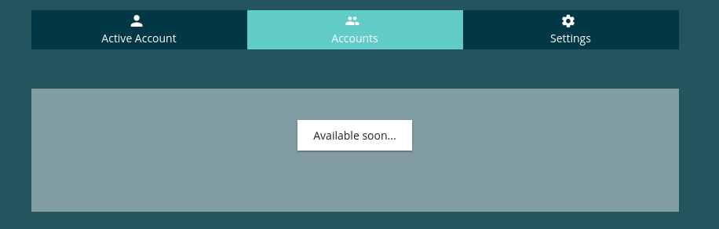

=======================
NotImplementedComponent
=======================

.. list-table:: 
   :widths: auto
   :stub-columns: 1

   * - Source
     - `not-implemented <https://github.com/evannetwork/ui-angular-core/blob/develop/src/components/not-implemented>`__
     
Shows an easy "not-implemented" overlay.

-------
Example
-------
- html

::

  <not-implemented></not-implemented>

------------
View Example
------------

