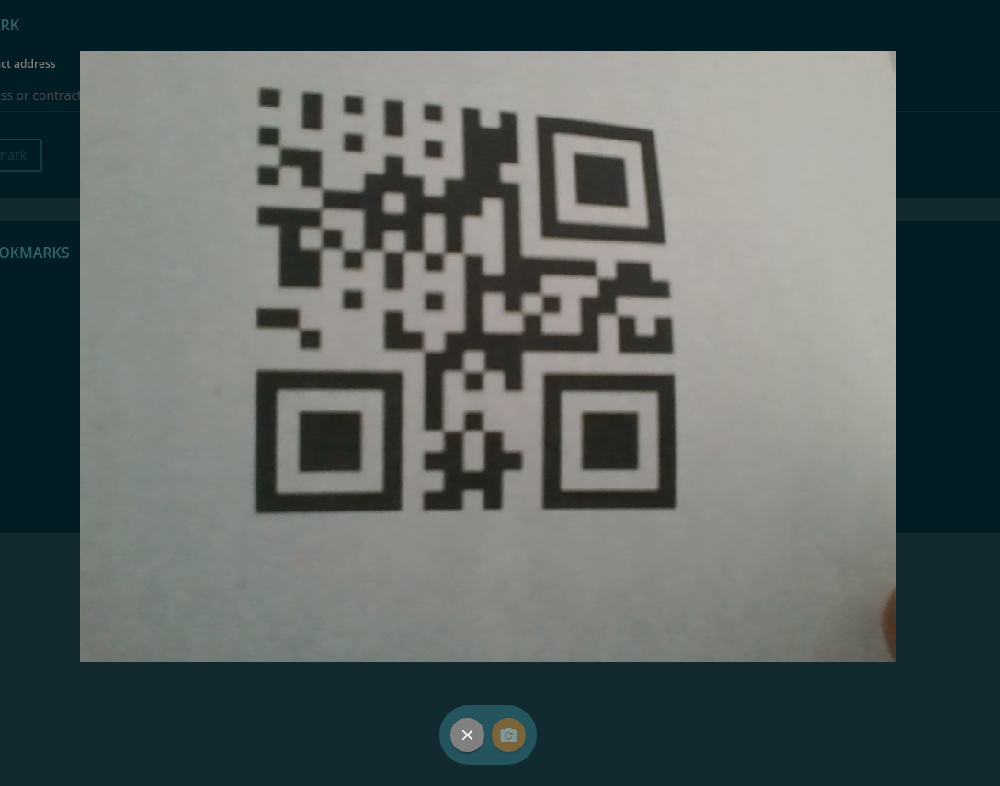

=================
EvanQrCodeService
=================

.. list-table:: 
   :widths: auto
   :stub-columns: 1

   * - Source
     - `qr-code <https://github.com/evannetwork/ui-angular-core/blob/develop/src/services/ui/qr-code.ts>`__

QR-Code Scanner service for HTML 5 / IOS / Android.

--------------------------------------------------------------------------------

.. _document_scanQRCode:

scanQRCode
================================================================================

.. code-block:: typescript

  qrCodeService.scanQRCode(arguments);

Scan an qr code and returns the result as string.

-------
Returns
-------

``Promise`` returns ``string``: qr-code result

-------
Example
-------

.. code-block:: typescript

  try {
    const value = await this.qrCodeService.scanQRCode();

    this.dappForm.controls['ensAddress'].setValue(value);
    this.submit(value);

    this.ref.detectChanges();
  } catch (ex) { }

------------
View Example
------------
Looks on browsers like the following:

