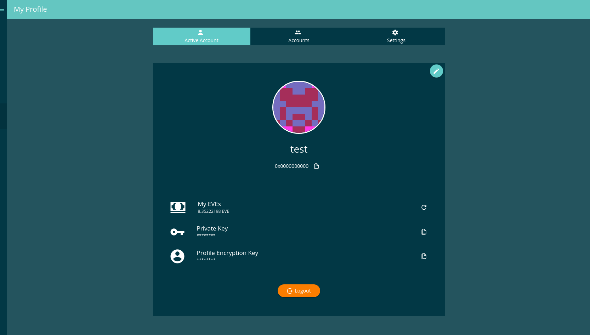

==================
Content Containers
==================

Should be used for any content container to create uniform and smooth surfaces, with the same spaces and colors. The general class to start with is "evan-content".

.evan-content
=============

-------
Example
-------

::

  

    <h2 class="content-header m-b-0 m-t-0">{{ 'im-a-header' | translate }}</h2>
  

  
------------
View Example
------------

.evan-full-content
==================

Use always 100% of width.

::

  

    <h2 class="content-header m-b-0 m-t-0">{{ 'im-a-header' | translate }}</h2>
  

.evan-small-content
===================
Use a small view with responsive sizes.

- min-width 993px : width 70%;
- min-width 1201px : width 60%;
- min-width 1501px : width 50%;

------------
View Example
------------

.evan-mini-content
===================
Use a very small view with responsive sizes.

- min-width 1201px : width 40%;

--------------
evan-mini-left
--------------
Use a very small view with responsive sizes. Perfect in combination with evan-mini-content for a responsive 3 column layout.

- min-width 1201px : width 30%;
- position: fixed  (used within dapp-wrapper)
- left: 0

---------------
evan-mini-right
---------------
Use a very small view with responsive sizes. Perfect in combination with evan-mini-content for a responsive 3 column layout.

- min-width 1201px : width 30%;
- position: fixed
- top: 56px (used within dapp-wrapper)
- right: 0

-------
Example
-------

::

  

    <button ion-button icon-left clear
      [class.active]="activeTab === 0" 
      (click)="activateTab(0);">
      <ion-icon name="person"></ion-icon>
     Tab 1
    </button>
  
    <button ion-button icon-left clear
      [class.active]="activeTab === 1" 
      (click)="activateTab(1);">
      <ion-icon name="people"></ion-icon>
      {{ '_dappprofile.accounts' | translate }}
    </button>
    
    <button ion-button icon-left clear
      [class.active]="activeTab === 2" 
      (click)="activateTab(2);">
      <ion-icon name="settings"></ion-icon>
      {{ '_dappprofile.settings' | translate }}
    </button>
  

  
  

    
 1200">
      Content left
    

    
 1200">
      Content center
    

    
 1200">
      Content right
    

  

------------
View Example
------------

- On big screens

- On small screens

.evan-twoline-content
=====================

Display two content containers next to each other using display inline-block. On small devices they will move one under another.

-------
Example
-------

::

  
left

  
right

.evan-threeline-content
=======================

Display three content containers next to each other using display inline-block. On small devices they will move one under another.

-------
Example
-------

::

  
left

  
center

  
right

.evan-info-button
=================

Display a button on the top right corner with the fixed size of 35px:35px.

-------
Example
-------

::

  

    <button class="evan-info-button" ion-button icon-only>
      <ion-icon name="info"></ion-icon>
    
 
  

Custom botton positions
=======================

----------------
button.top-right
----------------
Display a button on the top right corner of the evan-content. Be sure, thath the evan-content element hash the "position:relative" style.

::

  

    <button class="top-right" ion-button icon-only>
      <ion-icon name="info"></ion-icon>
    
 
  

-------------------
button.bottom-right
-------------------
Display a button on the bottom right corner of the evan-content. Be sure, thath the evan-content element hash the "position:relative" style.

::

  

    <button class="bottom-right" ion-button icon-only>
      <ion-icon name="info"></ion-icon>
    
 
  

--------------------
button.bottom-center
--------------------
Display a button in the bottom center of the evan-content. Be sure, thath the evan-content element hash the "position:relative" style.

::

  

    <button class="bottom-center" ion-button icon-only>
      <ion-icon name="info"></ion-icon>
    
 
  

----------------
.evan-left-panel
----------------
Shows a small left panel for displaying a inner app navigation list.

:: 

    

      <b class="content-header m-t-0">
        {{ '...' | translate }}
      </b>

      <ion-list>
        <button ion-item menuClose 
          color="light"
          [class.active]="activeGroup === group"
          *ngFor="let group of navigation"
          (click)="activeGroup = group; ref.detectChanges()">
          <h2>{{ group.header }}</h2>
          <h3>{{ group.desc }}</h3>
        </button>
      </ion-list>
    

-----------------
.evan-right-panel
-----------------
Shows a large panel for display content that was managed using the evan-left-panel

::

    

      ....
    
