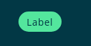
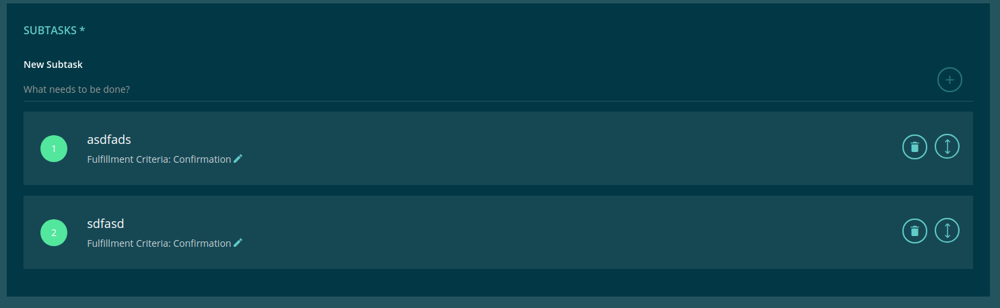

===================
Round Status Labels
===================

.evan-label
===========
Shows an outline label. Add more style using the following classes: 

==============================  ================================================================================================
Class                           Description 
==============================  ================================================================================================
.label-rouded                   add border-radious to the label
.label-info                     add yellow color to the label
.label-success                  add green color to the label
.label-danger                   add red color to the label
==============================  ================================================================================================

-------
Example
-------

::

  
    {{ (task.contractState == '7' ? '_digitaltwin.finished' : '_digitaltwin.rented') | translate }}
  

------------
View Example
------------

.evan-circle
============
Shows an label as an round element.

-------
Example
-------

::

  

    <ng-container *ngIf="!todo.loading">{{ i + 1 }}</ng-container>
    <ion-spinner color="primary" *ngIf="todo.loading" margin-right></ion-spinner>
  

------------
View Example
------------

