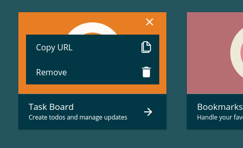
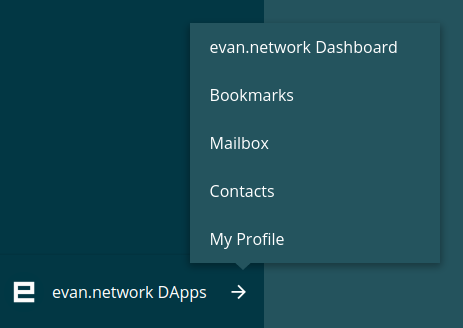

=================
Popover & Callout
=================

Popover
=======

Uses an HTML element to show it within an small layout within any component.

-------
Example
-------
- Reference Implementation: `DApp List <https://github.com/evannetwork/ui-core-dapps/blob/develop/dapps/favorites/src/components/dapp-list/dapp-list.html>`_

::

  

    ...
  

------------
View Example
------------

Callout
=======

Uses an `ion-select <https://ionicframework.com/docs/components/#select>`_ and removes the default select styles to show only a simple callout.

-------
Example
-------
- Reference Implementation: `SplitPaneComponent <https://github.com/evannetwork/ui-angular-core/blob/develop/src/components/split-pane/split-pane.html>`_

::

  <ion-select class="evan-callout" interface="popover" #rootDAppSelect
    [(ngModel)]="rootDAppSelectValue"
    [selectOptions]="footerSelectOptions"
    (ionChange)="openDApp(rootDAppSelect)">
    <ion-option *ngFor="let rootDApp of rootDApps"
      [value]="rootDApp">
      {{ rootDApp?.translated.name }}
    </ion-option>
  </ion-select>

------------
View Example
------------

   
