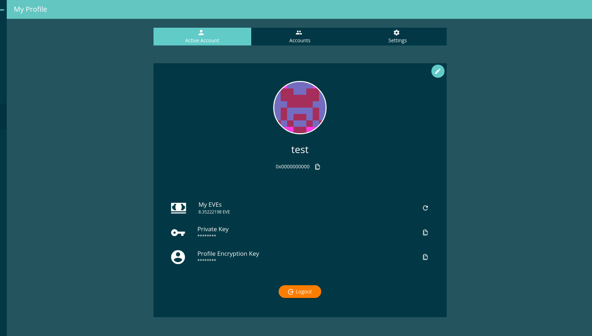

====
Tabs
====

Tabs are basicly included into Ionic. But for a simply tab implementation with html you can use the following Sample (have a look at `Tab animations </angular-core/animations/tab.html>`_:

- Reference Implementation: `Profile DApp <https://github.com/evannetwork/ui-core-dapps/blob/develop/dapps/profile/src/components/profile/profile.html>`_

.. code-block:: typescript

  @Component({
    ...
    animations: [
      createTabSlideTransition(),
    ]
  })

::

  

    <button ion-button icon-left clear
      [class.active]="activeTab === 0" 
      (click)="activateTab(0);">
      <ion-icon name="person"></ion-icon>
     Tab 1
    </button>
  
    <button ion-button icon-left clear
      [class.active]="activeTab === 1" 
      (click)="activateTab(1);">
      <ion-icon name="people"></ion-icon>
      {{ '_dappprofile.accounts' | translate }}
    </button>
    
    <button ion-button icon-left clear
      [class.active]="activeTab === 2" 
      (click)="activateTab(2);">
      <ion-icon name="settings"></ion-icon>
      {{ '_dappprofile.settings' | translate }}
    </button>
  

  
  

    

      Content left
    

    

      Content center
    

    

      Content right
    

  

------------
View Example
------------

