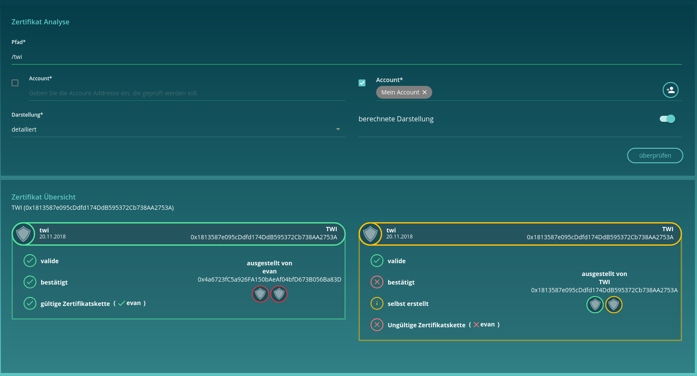

===========================
EvanClaimsOverviewComponent
===========================

.. list-table:: 
   :widths: auto
   :stub-columns: 1

   * - Source
     - `EvanClaimsOverviewComponent <https://github.com/evannetwork/ui-core-dapps/tree/develop/dapps/claims/src/components/claims>`__
     
Explorer claims using an topic, subject input. If needed, all interactions can be disabled and only the given parameters are used. When the dev mode is enabled, also the display mode can be adjusted for testing purposes.

It can also be used to display simply a list of claims and you does not need to implement anything by yourself.

------
Inputs
------
#. ``subject`` - ``string``: overwrite the address for loading claims
#. ``topics`` - ``Array<string>``: predefined set of topics to show, this will disable input field
#. ``showTopicSelect`` - ``boolean`` (default = false): should the topic select displayed?
#. ``showAddressSelect`` - ``boolean`` (default = false): should the topic select displayed?
#. ``displayMode`` - ``string`` (default = 'detail'): overwrite the default display mode of the claims
#. ``computedClaims`` - ``boolean`` (default = true): Show only one combined claim card for each topic

-------
Example
-------
Reference Implementation: `Evan Contract Explorer <https://github.com/evannetwork/ui-core-dapps/tree/develop/dapps/explorer/src/components/claims>`_

- minimal view

::

  <evan-claims-inspect
    [subject]="contractAddress"
    [topics]="[ '/test' ]"
    [displayMode]="'normal'"
    [computedClaims]="true"
    [showAddressSelect]="false"
    [showTopicSelect]="false">
  </evan-claims-inspect>

- large view

::

  <evan-claims-inspect
    [subject]="contractAddress"
    [displayMode]="'detail'"
    [computedClaims]="false"
    [showAddressSelect]="false"
    [showTopicSelect]="true">
  </evan-claims-inspect>

------------
View Example
------------

