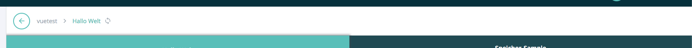

===========
breadcrumbs
===========

.. list-table:: 
   :widths: auto
   :stub-columns: 1

   * - Source
     - `breadcrumbs <https://github.com/evannetwork/ui-core/tree/master/dapps/ui.libs/src/breadcrumbs.scss>`__

Used to create a breadcrumb navigation bar.

-------
Example
-------
- Reference Implementation: `Vue Breadcrumbs Component <https://github.com/evannetwork/ui-vue/blob/master/dapps/evancore.vue.libs/src/components/breadcrumbs/breadcrumbs.vue>`_

------------
View Example
------------

