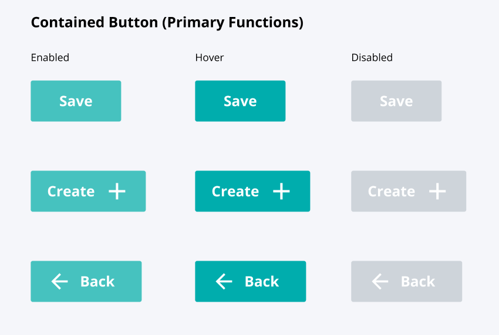
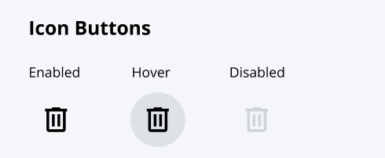
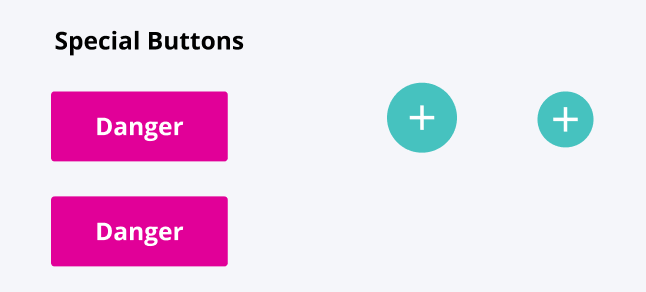

=======
buttons
=======

.. list-table:: 
   :widths: auto
   :stub-columns: 1

   * - Source
     - `buttons <https://github.com/evannetwork/ui-core/tree/master/dapps/ui.libs/src/style/buttons.scss>`__
   * - Bootstrap
     - `buttons <https://getbootstrap.com/docs/4.3/components/buttons>`__

In general, the button designs are defined by bootstrap. Some small adjustments are made by evan, to make them more generalized.

Note: By using icons within the buttons, just add the `left` / `right` class to the `i` element, so it will be positioned correctly. Also `spinners` can be used directly within the buttons.

---------------
primary
---------------

.. code-block:: html

  <button class="btn btn-primary">
    <i class="mdi left mdi-arrow-left"></i>
    primary icon left
  </button>

---------------
secondary
---------------

.. code-block:: html

  <button class="btn btn-outline-primary">
    secondary icon
    <i class="mdi right mdi-arrow-right"></i>
  </button>

.. image:: ../../../images/core/buttons/secondary.png
  :width: 300

---------------
text
---------------

.. code-block:: html

  <button class="btn btn-text-primary">
    

    text-primary spinner left
  </button>

.. image:: ../../../images/core/buttons/text.png
  :width: 300

---------------
icon
---------------

.. code-block:: html

  <button class="btn btn-icon-secondary">
    <i class="mdi mdi-plus"></i>
  </button>

---------------
special
---------------

.. code-block:: html

  <button class="btn btn-danger">
    danger
  </button>

  <button class="btn btn-primary btn-circle">
    <i class="mdi mdi-plus"></i>
  </button>

