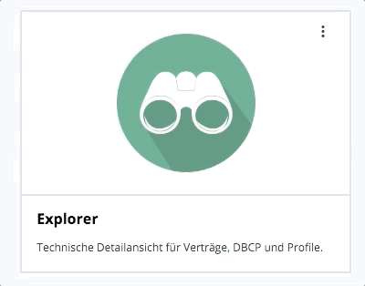
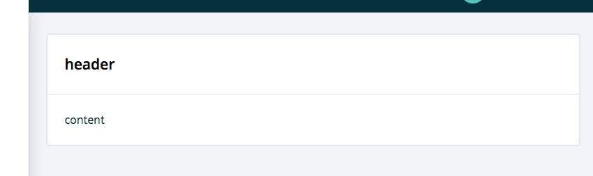
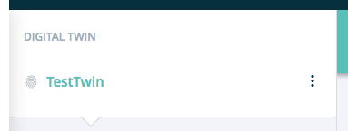

=======
content
=======

.. list-table:: 
   :widths: auto
   :stub-columns: 1

   * - Source
     - `content <https://github.com/evannetwork/ui-dapps/tree/master/dapps/ui.libs/src/style/content.scss>`__

==============================  ================================================================================================
Class                           Description 
==============================  ================================================================================================
.bg-level-1                     background-color white
.bg-level-2                     background-color #f5f6fa
.bg-level-3                     background-color #f5f6fa
.bg-inverted                    background-color dark
.fullscreen                     position fixed and scaled to full screen
.container-wide                 3% horizontal padding, 30px vertical padding 
==============================  ================================================================================================

---------------
.evan-highlight
---------------

Highlight a dom element with a transform animation.

.. code-block:: html

  

    <a class="
      d-block
      p-3 col-lg-12 col-xl-3
      m-md-3 mb-3 p-4
      text-center
      bg-level-1 border evan-highlight"
      style="min-width: 250px"
      :href="`${ dapp.fullUrl }/${ type.path }`">
      

      <h3 class="highlight font-weight-semibold mb-3">
        card title
      </h3>
      
        card description
      
    </a>
  

----------
.white-box
----------

White container for seperating content display from background.

.. code-block:: html

  

    

      <h3 class="m-0 font-weight-semibold">
        header
      </h3>
    

    

      content
    

    

      footer
    

  

--------------
.evan-triangle
--------------
Display a conversation bubble like triangle at the corresponding div.

.. code-block:: html

  

    

      <small class="text-muted text-uppercase font-weight-semibold">
        header
      </small>
    

  

