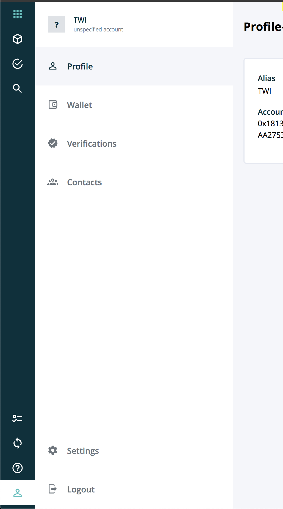

========
nav-list
========

.. list-table:: 
   :widths: auto
   :stub-columns: 1

   * - Source
     - `nav-list <https://github.com/evannetwork/ui-dapps/tree/master/dapps/ui.libs/src/style/nav-list.scss>`__

Optimized list styling for building list navigations using the `nav-list <https://github.com/evannetwork/ui-dapps/tree/master/dapps/ui.libs/src/style/nav-list.scss>`__
 
-------
Example
-------
- Reference Implementation: `Nav-List Component <https://github.com/evannetwork/ui-dapps/blob/develop/dapps/components.vue/src/components/nav-list/nav-list.vue>`_

.. code-block:: html

  

    <a
      id="nav-entry-detail"
      href="http://localhost:3000/dev.html#/dashboard.vue.evan/profile.vue.evan/detail">
      <i class="mr-3 mdi mdi-account-outline"></i>
      Top Nav Entry
    </a>

    

      <a
        id="nav-entry-detail"
        href="http://localhost:3000/dev.html#/dashboard.vue.evan/profile.vue.evan/detail"
        class="active entry-1">
        <i class="mr-3 mdi mdi-account-outline"></i>
        Nav Entry
      </a>
      
        <i class="mr-3 mdi mdi-account-outline"></i>
        Nav Entry 2
      </a>
    

    <a
      id="nav-entry-detail"
      href="http://localhost:3000/dev.html#/dashboard.vue.evan/profile.vue.evan/detail">
      <i class="mr-3 mdi mdi-account-outline"></i>
      Bottom Nav Entry
    </a>
  

