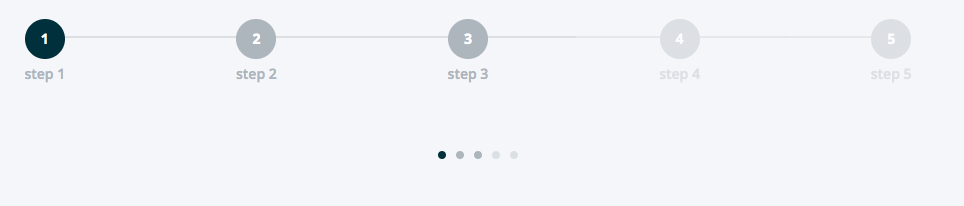

=====
steps
=====

.. list-table:: 
   :widths: auto
   :stub-columns: 1

   * - Source
     - `config <https://github.com/evannetwork/ui-core/tree/master/dapps/ui.libs/src/style/config.scss>`__

Styling for html steppers.

-------
Example
-------

.. code-block:: html

  

    

      <button class="btn">
        
          1
        
        Step 1
      </button>
      <button class="btn">
        
          1
        
        Step 1
      </button>
      <button class="btn">
        
          1
        
        Step 1
      </button>
    

------------
View Example
------------

