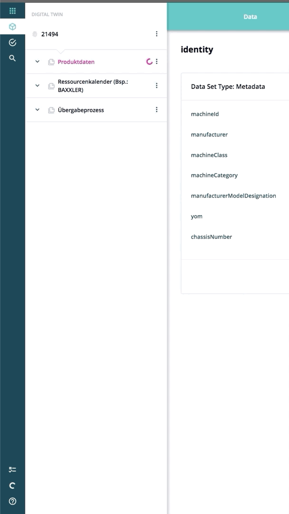

===========
swipe-panel
===========

.. list-table:: 
   :widths: auto
   :stub-columns: 1

   * - Source
     - `swipe-panel <https://github.com/evannetwork/ui-dapps/tree/master/dapps/ui.libs/src/style/swipe-panel.scss>`__

A swipe panel design for displaying context sensetive content that swipes in.

----------------
.evan-swipe-panel
----------------
Per default, the swipe panel can be configured in by applying the `.alignment-right` or `.alignment-left` class, so it will swipe in from the right or from the left. By adding the `.show` class, the `.evan-swipe-panel` element will swipe in.

.. code-block:: html

  

    swipe panel left
  

  

    swipe panel right
  

