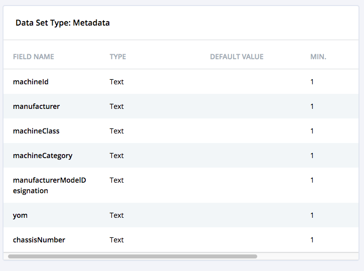
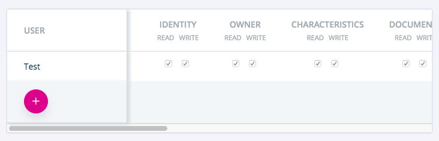

======
table
======

.. list-table:: 
   :widths: auto
   :stub-columns: 1

   * - Source
     - `table <https://github.com/evannetwork/ui-dapps/tree/master/dapps/ui.libs/src/style/table.scss>`__

Evan tables can be used in 2 different ways. Classic table styles or using the responsive flex table styles.

----------------
.evan-flex-table
----------------
On wide screens, just a normal table is displayed. The full table will be displayed with all benefits of a flex design. By applying the `responsive-table` class to the table, on small screens, the `thead` will be hidden and the `th` elements within the tbody will be displayed. Each `tr` will be displayed as a block.

.. code-block:: html

  <table class="evan-flex-table responsive-table">
    <thead>
      <tr>
        <th>alias</th>
        <th>id</th>
      </tr>
    </thead>
    <tbody>
      <tr class="clickable">
        <td class="text-primary">
          <th>alias</th>
          user name
        </td>
        <td>
          <th>id</th>
          1234
        </td>
      </tr>
    </tbody>
  </table>

.. image:: ../../../images/core/table-flex.gif
 :width: 600

-----------
.evan-table
-----------
Just a normal table, with the correct evan.network design. Add the `hover` class to the evan-table, so each `tr` will trigger and hover animation.

.. code-block:: html

  <table class="evan-table">
    <thead>
      <tr>
        <th>alias</th>
        <th>id</th>
      </tr>
    </thead>
    <tbody>
      <tr class="clickable">
        <td class="text-primary">
          <th>alias</th>
          user name
        </td>
        <td>
          <th>id</th>
          1234
        </td>
      </tr>
    </tbody>
  </table>

-------------------
.evan-table.no-wrap
-------------------
Large tables can be handled with an `overflow-x` container and the following enhanced classes.

.. code-block:: html

  

    <table class="evan-table hover">
      <thead>
        <tr>
          <th>alias</th>
          <th>id</th>
        </tr>
      </thead>
      <tbody>
        <tr class="clickable">
          <td class="text-primary">
            <th>alias</th>
            user name
          </td>
          <td>
            <th>id</th>
            1234
          </td>
        </tr>
      </tbody>
    </table>
  

------------------------
.evan-table.static-first
------------------------
Also a static first table design is available.

.. code-block:: html

  

    <table class="evan-table hover static-first">

    </table>
  

