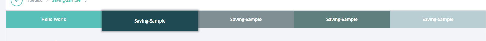

====
tabs
====

.. list-table:: 
   :widths: auto
   :stub-columns: 1

   * - Source
     - `tabs <https://github.com/evannetwork/ui-core/tree/master/dapps/ui.libs/src/tabs.scss>`__

-------
Example
-------

.. code-block:: html

  

    <a class="evan-tab tab-1 active" href="">
      tab 1
    </a>
    <a class="evan-tab tab-2 active" href="">
      tab 2
    </a>
    <a class="evan-tab tab-3 active" href="">
      tab 3
    </a>
    <a class="evan-tab tab-4 active" href="">
      tab 4
    </a>
  

------------
View Example
------------

