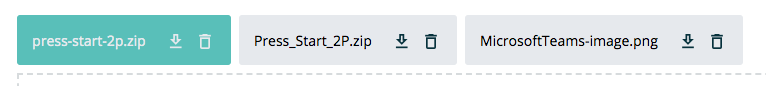

====
text
====

.. list-table:: 
   :widths: auto
   :stub-columns: 1

   * - Source
     - `text <https://github.com/evannetwork/ui-dapps/tree/master/dapps/ui.libs/src/style/text.scss>`__

==============================  ================================================================================================
Class                           Description 
==============================  ================================================================================================
.font-size-X                    Custom font-size levels in percentage (e.g.: font-size-1, font-size-2, ..., font-size-9)
.overflow-multiline             Enables multiline text overflow within overflow ellipsis logic, apply `line-X` class to define, how many lines should be displayed
.font-weight-semibold           sets font weight to 600
.flex-truncate                  https://css-tricks.com/flexbox-truncated-text/
.batch-label                    displays a small batched card
.btn-link                       removes link underline and pink color, adds dark color and turquoise hover / active color
==============================  ================================================================================================

------------
.batch-label
------------

.. code-block:: html

  

    {{ file.name }}

    <a class="btn p-0 ml-3"
      :href="file.blobUri"
      :download="file.name">
      <i class="mdi mdi-download-outline"></i>
    </a>
    <button
      id="file-input-remove"
      class="btn p-0 ml-1 delete"
      @click="removeFile($event, file, index)">
      <i class="mdi mdi-delete-outline"></i>
    </button>
  

------------
View Example
------------

