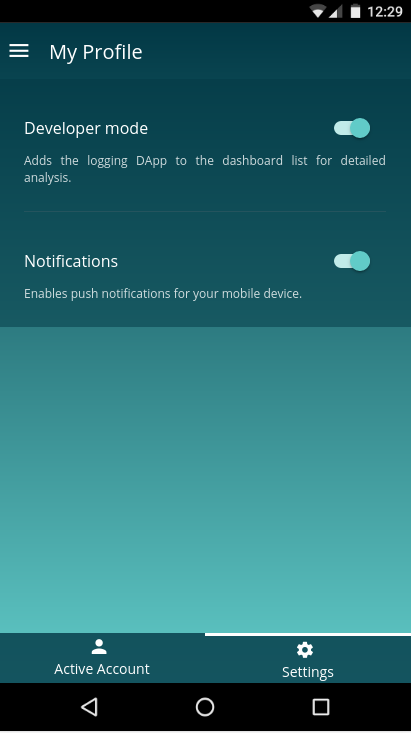

=============
notifications
=============

.. list-table:: 
   :widths: auto
   :stub-columns: 1

   * - Source
     - `Notifications <https://github.com/evannetwork/ui-dapp-browser/blob/develop/src/app/notifications.ts>`__

The dapp-browser provides an general notification handling for mobile devices. In the normal case,
the configuration of the push notifications are handled by the default evan.network applications. On
mobile  devices, notifications can be enabled by opening the profile / configuration DApp and
navigate to settings. On this page, you can enable and disable Push Notifications.

Notification additional payload (next to required properties like message, ...) should include the
following data:

#. ``standalone`` - ``boolean``: should the url opened relative to the current opened application or should be navigate to the absolute path
#. ``path`` - ``string``: url path that should be opened

By clicking on an notification when the app is closed, the dapp-browser will navigate directly to
the provided path. By using the angular-core, each incoming notification will trigger an popup, that
asks the user, if the frontend should navigate to this notification.

--------------------------------------------------------------------------------

Notification Event
================================================================================

Each incoming notification triggers also an document event and can be used by any applictaion. 

- general

.. code-block:: typescript

  window.addEventListener('evan-notification', (notification) => console.log(notification));

- angular-core

.. code-block:: typescript

  this.utilService.onEvent('evan-notification', (notification) => console.log(notification));

A notification will include the following content:

- android

::

  {
    "standalone": "false",
    "tap": false,
    "body": "New awesome updates for the evan.network. Check it out.",
    "path": "0x1A4A7eb67A892F981503233Ea166B545b8ec4D6C",
    "evanNotificationOpened": true
  }

- ios
 
::

 {
    "standalone": "false",
    "google.c.a.c_l": "test",
    "google.c.a.e": "1",
    "tap": false,
    "aps": {
      "alert": "New awesome updates for the evan.network. Check it out."
    },
    "gcm.n.e": "1",
    "google.c.a.c_id": "3950117635391799841",
    "path": "0x1A4A7eb67A892F981503233Ea166B545b8ec4D6C",
    "google.c.a.udt": "0",
    "google.c.a.ts": "1533737413",
    "gcm.message_id": "0:1533737417425695%0422c0910422c091"
  }

--------------------------------------------------------------------------------

Enable / Disable Notifications programmatically
================================================================================
Notifications can be enabled or disabled by setting an localStorage variable and by emitting the
following event:

::

  sendEvent(name: string, data?: any) {
    const event = new CustomEvent(name, { detail: data });

    window.dispatchEvent(event);
  }

::

  window.localStorage['evan-notifications'] = true; // false
  this.utils.sendEvent('evan-notifications-toggled');

--------------------------------------------------------------------------------

notifications Array
================================================================================

The notifications instance exports an array that includes all notifications that were received,
while the mobile app is running. You can access it by the following code:

.. code-block:: typescript

  console.log(dappBrowser.notifications.notifications)

--------------------------------------------------------------------------------

getDAppUrlFromNotification
================================================================================
.. code-block:: javascript

    notifications.getDAppUrlFromNotification(notification);

Return the url of an notification that should be opened.

----------
Parameters
----------

#. ``notification`` - ``any``: notifiction object including standalone and path property (sample are provided within the Notification Event section)

-------
Returns
-------

``Promise`` returns ``string``: path that of the notification

-------
Example
-------

.. code-block:: typescript

  window.location.href = await notifications.getDAppUrlFromNotification(notification);

