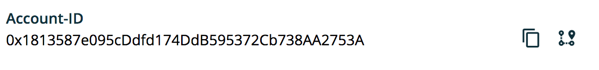

===============
AddressComponent
===============

.. list-table:: 
   :widths: auto
   :stub-columns: 1

   * - Source
     - `address <https://github.com/evannetwork/ui-vue/tree/master/dapps/evancore.vue.libs/src/components/address>`__
   * - Selector
     - ``evan-address``

The ``evan-address`` component allows general evan.network address interactions (copy, open in explorer) by hovering the address.

Props
=====

#. ``address`` - ``string``: Address that should be shown

Example
=======
- `Reference Implementation <https://github.com/evannetwork/ui-vue/blob/master/dapps/evancore.vue.libs/src/components/profile-preview/profile-preview.vue>`__

.. code-block:: html

  <evan-address :address="$store.state.runtime.activeAccount"></evan-address>

View Example
============

