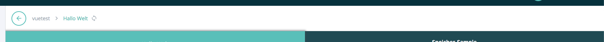

====================
BreadcrumbsComponent
====================

.. list-table:: 
   :widths: auto
   :stub-columns: 1

   * - Source
     - `breadcrumbs <https://github.com/evannetwork/ui-vue/tree/master/dapps/evancore.vue.libs/src/components/breadcrumbs>`__
   * - Selector
     - ``evan-breadcrumbs``
   * - style
     -  `breadcrumbs <../../../core/ui.libs/styling/breadcrumb.html>`__

Breadcrumb component that parses the currents browser url hash and displays a breadcrumb navigation for all entries. Also, each breadcrumb can be translated or ignored. Also backwards and reload buttons can be enabled.

#. ``breadcrumbs`` - ``Array<{ name: string, fallbackName: string, path: string }>``: active route, splitted by hash and prepared using the following params: name, fallbackName, path
#. ``hashChangeWatcher`` - ``any``: Watch for hash updates
#. ``wasDestroyed`` - ``boolean``: Was the component destroyed, before the hash change event was bind?
#. ``goBack`` - ``boolean``: Show the go back button
#. ``_baseHash`` - ``string``: Correctly used base hash (props should not be overwritten, so we copy the value to the _baseHash prop)
#. ``dappWrapperBreadcrumb`` - ``Element``: found dapp-wrapper breadcrumbs container element, where this element can be applied to

Props
=====

#. ``i18nScope`` - ``string``: Every route name will be translated using the leading i18nScope. Currents evan domain name will be replaced. E.g.: digitaltwins.evan => _evan.digitaltwins
#. ``enableReload`` - ``boolean``: Should the reload button be visible?
#. ``baseHash`` - ``string``: Change the route base hash that should be navigated to
#. ``attachToDAppWrapper`` - ``boolean``: Move the breadcrumbs element to the most top level dapp-wrapper
#. ``ignored`` - ``Array<string>``: Ignore specific breadcrumbs by applying the url parts that should be ignored

Example
=======
- `Reference Implementation <https://github.com/evannetwork/generator-evan/blob/master/generators/dapp/templates/vue/hello-world/src/components/root/root.vue>`__

.. code-block:: html

  <evan-breadcrumbs
      :attachToDAppWrapper="true"
      :i18nScope="'_digitaltwins.breadcrumbs'"
      :ignored="[
        'dc-detail',
        'dt-detail',
        'data-set',
        `datacontainer.digitaltwin.${ dapp.domainName }`,
        `digitaltwin.${ dapp.domainName }`,
      ]">
    </evan-breadcrumbs>

View Example
============

