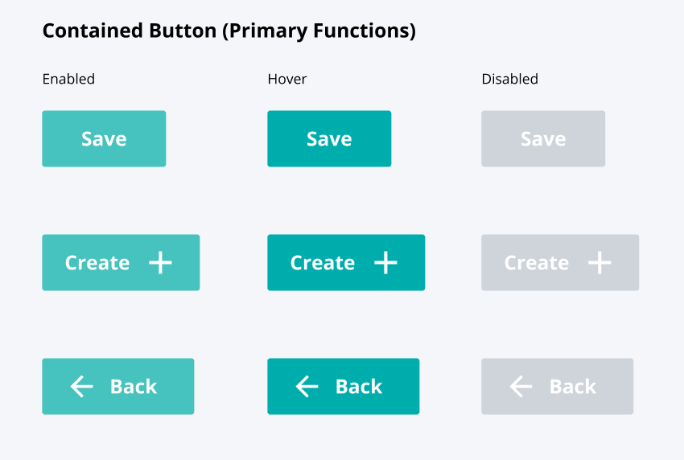
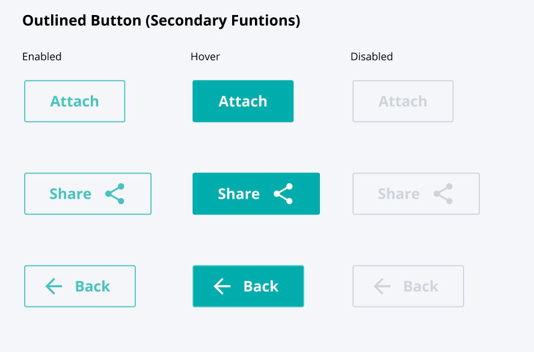
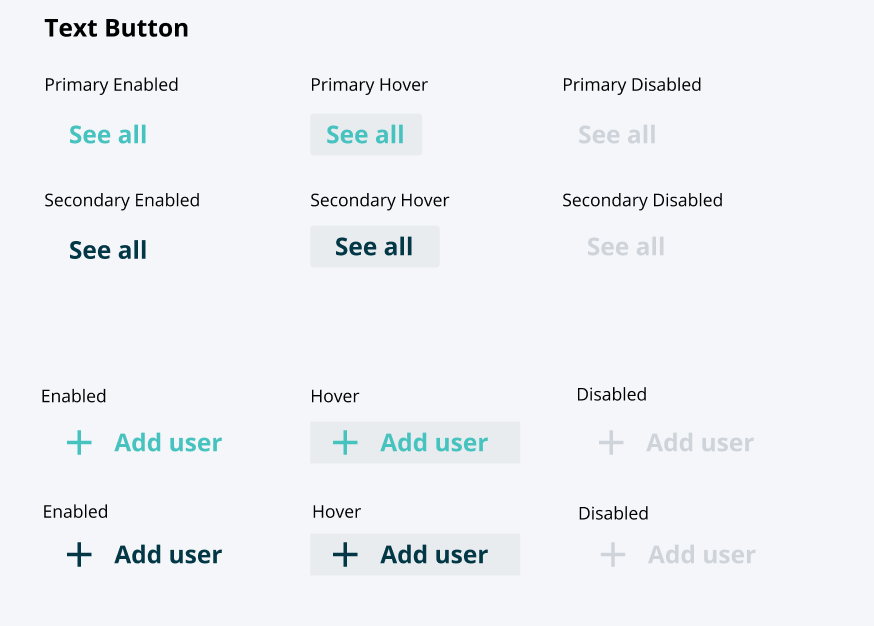
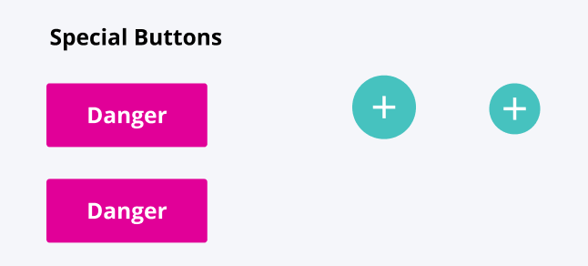

===============
ButtonComponent
===============

.. list-table:: 
   :widths: auto
   :stub-columns: 1

   * - Source
     - `button <https://github.com/evannetwork/ui-vue/tree/master/dapps/evancore.vue.libs/src/components/button>`__
   * - Selector
     - ``evan-button``
   * - style
     -  `buttons <../../../core/ui.libs/styling/buttons.html>`__

The `evan-button` component is a generalized wrapper for bootstrap styled evan.network buttons. Basicly this component only wraps the basic bootstrap designs, so they will be maintained centralized.

For a generalized overview about the button definitions, please have a look at the `design specifications <../../../core/ui.libs/styling/buttons.html>`__

Props
=====

#. ``disabled`` - ``string``: Button disabled state
#. ``size`` - ``string`` (default: normal): Button size specifications (lg, normal, sm)
#. ``type`` - ``string``: generalized evan button type (icon, icon-primary, icon-secondary, link, primary, secondary, text, text-primary, text-secondary)

Example
=======
- `Reference Implementation <https://github.com/evannetwork/ui-core-dapps/blob/develop/dapps/components.vue/src/components/buttons/buttons.vue>`__

.. code-block:: html

  <evan-button type="primary">
    primary button
  </evan-button>

  <evan-button type="primary">
    primary button with button
    <i class="right mdi mdi-plus"></i>
  </evan-button>

  <evan-button type="secondary">
    <i class="right mdi mdi-left"></i>
    secondary button with button
  </evan-button>

  <evan-button type="danger" size="sm">
    secondary button
  </evan-button>

  <evan-button type="text" size="lg">
    text button
  </evan-button>

  <evan-button type="icon" disabled="true">
    <i class="right mdi mdi-plus"
  </evan-button>

View Example
============

.. image:: ../../../images/core/buttons/icon.png
  :width: 300

