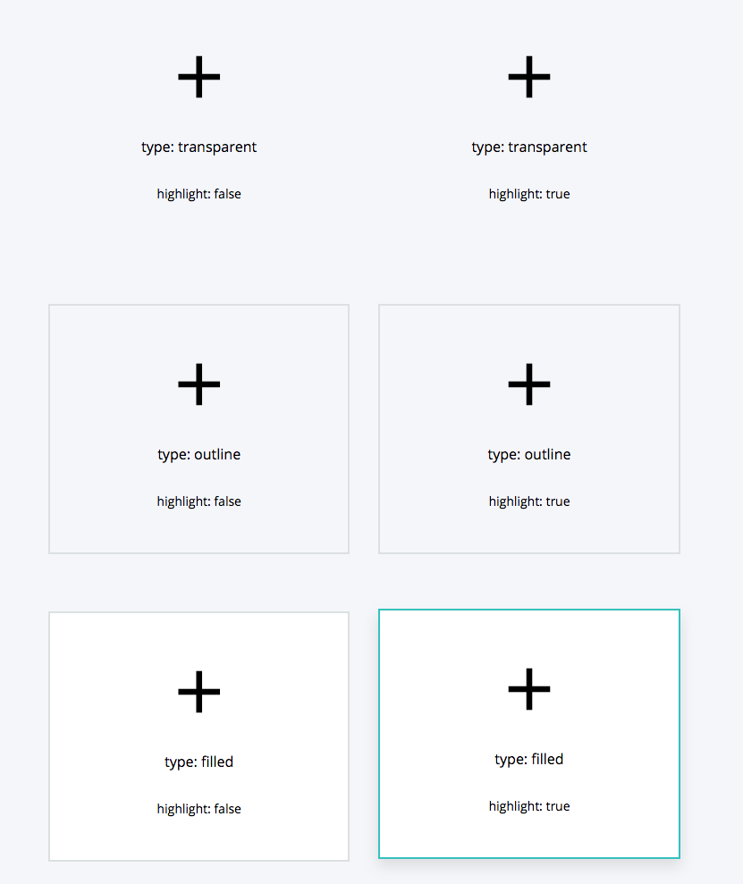

==============
CardsComponent
==============

.. list-table:: 
   :widths: auto
   :stub-columns: 1

   * - Source
     - `card <https://github.com/evannetwork/ui-vue/tree/master/dapps/evancore.vue.libs/src/components/card>`__
   * - Selector
     - ``evan-card``

Displays a small colored batch for previewing a users account / name.

Props
=====

#. ``type`` - ``string``: Card type that should be used (transparent, outline, filled)
#. ``href`` - ``string``: Optional href, to transform the card into a link element.
#. ``highlight`` - ``boolean``: Add hover shadow and size effect

Example
=======
- `Reference Implementation <https://github.com/evannetwork/ui-core-dapps/tree/develop/dapps/components.vue/src/components/cards/cards.vue>`__

.. code-block:: html

  <evan-card
    :type="type"
    :highlight="highlight">
    <i class="mdi mdi-plus"></i>
    <h5>type: {{ type }}</h5>
    highlight: {{ highlight }}
  </evan-card>

View Example
============

