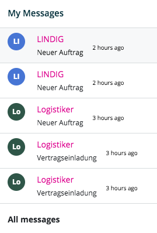

=====================
ContactBatchComponent
=====================

.. list-table:: 
   :widths: auto
   :stub-columns: 1

   * - Source
     - `contact-batch <https://github.com/evannetwork/ui-dapps/tree/master/dapps/evancore.vue.libs/src/components/contact-batch>`__
   * - Selector
     - ``evan-contact-batch``

Displays a small colored batch for previewing a users account / name.

#. ``batch`` - ``string``: Short batch title (Test User => TU, Employee => EM)
#. ``bgColor`` - ``string``: Batch specific random hex color code.
#. ``textColor`` - ``string``: text color for the specific background color.

Props
=====

#. ``value`` - ``string``: String for that the batch should be generated

Example
=======
- `Reference Implementation <https://github.com/evannetwork/ui-dapps/blob/master/dapps/evancore.vue.libs/src/components/dapp-wrapper/dapp-wrapper.vue>`__

.. code-block:: html

  <evan-contact-batch
    v-model="'Test User'">
  </evan-contact-batch>

View Example
============

