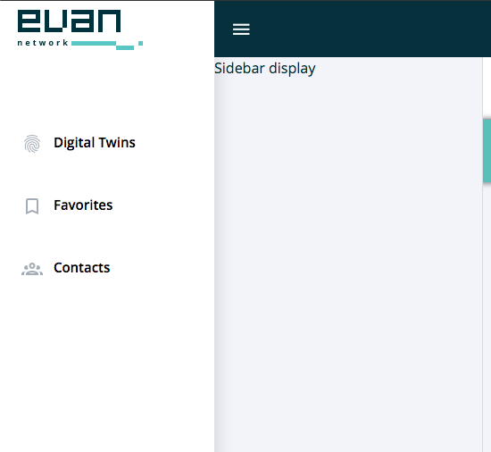
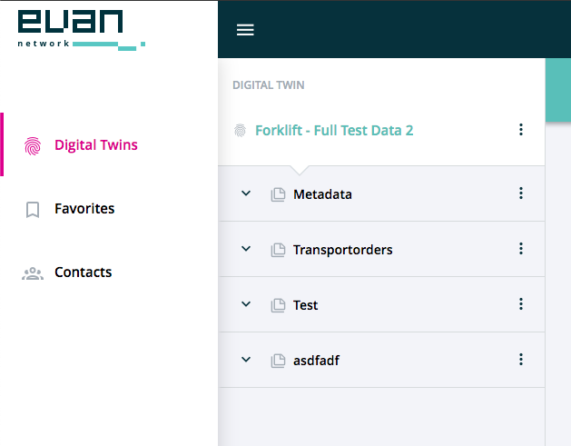

=================================
DAppWrapperSidebarLevel2Component
=================================

.. list-table:: 
   :widths: auto
   :stub-columns: 1

   * - Source
     - `dapp-wrapper-level-2 <https://github.com/evannetwork/ui-vue/tree/master/dapps/evancore.vue.libs/src/components/dapp-wrapper-level-2>`__
   * - Selector
     - ``evan-dapp-wrapper-level-2``
   * - style
     -  `breadcrumbs <../../../core/ui.libs/styling/dapp-wrapper.html>`__

The dapp-warpper has the functionality, that a custom second level navigation can be applied. Using this component, this content container does not must be filled directly, it can be filled from every child component, even from nested, fully seperated dapps. The content that will be applied to the dapp-wrapper-level-2 component, will be moved to the highest available dapp-wrapper component. The content will be overwritten, when another DAppWrapperLevel2 component will be started or, if this included dapp was destroyed.

#. ``highestSidebar`` - ``Element``: found dapp-wrapper-sidebar 2 container element, where this element can be applied to
#. ``contentElement`` - ``Element``: Child element that contains the level 2 content
#. ``isDestroyed`` - ``string``: Run destoyed method only ones

--------------------------------------------------------------------------------

.. _dappWrapperLevel2_hide:

hide
================================================================================

.. code-block:: typescript

  $refs.wrapperLevel2.hide();

Sends the `dapp-wrapper-sidebar-close` event.

--------------------------------------------------------------------------------

Example
=======
- `Reference Implementation <https://github.com/evannetwork/ui-core-dapps/blob/master/dapps/digital-twin.data-container/src/components/root/root.vue>`__

.. code-block:: html

  <evan-dapp-wrapper-level-2>
    <template v-slot:content>
      ...
    </template>
  </evan-dapp-wrapper-level-2>

View Example
============

