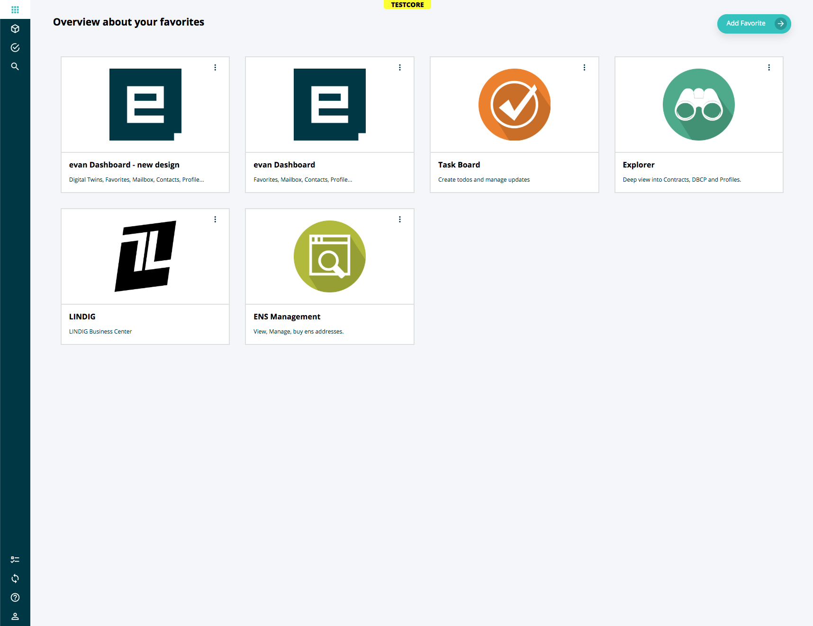

===========
DAppWrapper
===========

.. list-table:: 
   :widths: auto
   :stub-columns: 1

   * - Source
     - `dapp-wrapper <https://github.com/evannetwork/ui-vue/tree/master/dapps/evancore.vue.libs/src/components/dapp-wrapper>`__
   * - Selector
     - ``evan-dapp-wrapper``

Each DApp must be wrapped with the evan-dapp-wrapper component. This component will handle the complete login process and it is nessecary to use the ``getRuntime`` that is included into the `EvanComponent <../js/components.html>`__ function. It also provides this UI interactions:

  - Dispatcher Interaction
  - Mailbox Notifications
  - Profile, Addressbook, Favorites, Mailbox Links…
  - Top Panel
  - Left Panel
  - Login & Logout

It also provides content containers for a second left panel tree and a persistent breadcrumb navigation, that can be applied by every component. Have a look at the breadcrumbs / dapp-wrapper-level-2 component.

#. ``loading`` - ``boolean``: is the current dapp-wrapper gets initialized? => use loading to don't render dapp-loader or something quickly and directly after this remove the content and show the login or onboarding
#. ``smallToolbar`` - ``boolean``: is the small toolbar shown on large devices?
#. ``enableSidebar`` - ``boolean``: is the small toolbar shown on large devices? Is the sidebar enabled and should be shown? Per defaul enabled, but when no routes are defined or the user is within an onboarding or login process, it will be true.
#. ``enableNav`` - ``boolean``: Enables the nav bar icons including mailbox, synchronisation, .... Will be disabled uring login or onboarding process.
#. ``showSideBar`` - ``boolean``: show sidebar on small / medium devices?
#. ``showSideBar2`` - ``boolean``: show second level navigation on small devices?
#. ``visibleSideBar2`` - ``boolean``: Move (but not remove) sidebar level 2 to show main navigation
#. ``login`` - ``Function|boolean``: login function that was applied by the setPasswordFunction
#. ``onboarding`` - ``Function|boolean``: onboarding dapp is opened, so the user isn't logged in
#. ``userInfo`` - ``any``: current user informations
  #. ``addressBook`` - ``any``: loaded addressbook
  #. ``alias`` - ``string``: users alias
  #. ``loading`` - ``boolean``: user is loading
  #. ``mails`` - ``any``: loaded mails
  #. ``mailsLoading`` - ``boolean``: are mails loading currently?
  #. ``newMailCount`` - ``number``: count of new mails
  #. ``readMails`` - ``Array<string>``: read mail array loaded from localStorage
  #. ``totalMails`` - ``number``: count of all available mails
#. ``coreRoutes`` - ``Array<any>``: Core routes that will be displayed in the top right user dropdown
  #. ``title`` - ``string``: title that should be displayed
  #. ``path`` - ``string``: path of the route
  #. ``icon`` - ``string``: icon that should be displayed

Props
=====

#. ``brandLarge`` - ``string`` default($store.state.uiLibBaseUrl + '/assets/evan-logo-dark-half.svg'): url to img for large sidebar (default is set in the create function using $store)
#. ``brandSmall`` - ``string``: url to img for large sidebar (default is set in the create function using $store)
#. ``routes`` - ``Array<any>``: routes that should be displayed in the sidepanel, if no sidebar slot is given
  #. ``name`` - ``string``: route that should be opened
  #. ``icon`` - ``string``: icon in the left panel 
  #. ``title`` - ``string``: title that should be displayed, will be translated
#. ``bottomRoutes`` - ``Array<any>``: organized like the normal routes, but displayed smaller on the bottom of the nav
  #. ``name`` - ``string``: route that should be opened
  #. ``icon`` - ``string``: icon in the left panel 
  #. ``title`` - ``string``: title that should be displayed, will be translated
#. ``routeBaseHash`` - ``string`` (default $store.state.dapp.baseHash): base url of the vue component that uses the dapp-wrapper (e.g.: dashboard.evan)
#. ``createRuntime`` - ``boolean``: should be the runtime created? Includes onboarding & login checks.

Send Events
===========

#. ``loggedin``: triggered when ``createRuntime`` Prop was set to true and the user has logged in

Watch Events
============

#. ``dapp-wrapper-sidebar-close``: Can be used to close the left panel on small devices (e.g.: by using dapp-wrapper-level-2 navigation)

  .. code-block:: typescript

    window.dispatchEvent(new CustomEvent('dapp-wrapper-sidebar-close', {
      detail: { }
    }));

Example
=======
- `Reference Implementation <https://github.com/evannetwork/ui-core-dapps/blob/master/dapps/digital-twin.data-container/src/components/root/root.vue>`__

.. code-block:: html

  <evan-dapp-wrapper :routes="[ ]"
    @loggedin="initialize()">
    <template v-slot:header>
      <dt-breadcrumbs></dt-breadcrumbs>
    </template>
    <template v-slot:content>
      <evan-loading v-if="loading"></evan-loading>
      <template v-else>
        <evan-dapp-wrapper-level-2 ref="level2Wrapper">
          <template v-slot:content>
            

            

          </template>
        </evan-dapp-wrapper-level-2>
        <transition name="fade" mode="out-in">
          <router-view></router-view>
        </transition>
      </template>
    </template>
  </evan-dapp-wrapper>

View Example
============

