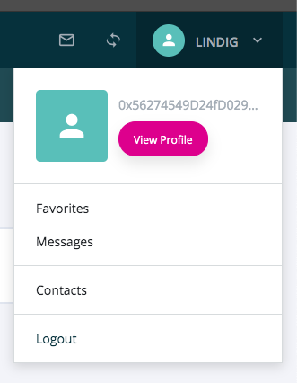

============
EvanDropdown
============

.. list-table:: 
   :widths: auto
   :stub-columns: 1

   * - Source
     - `dropdown <https://github.com/evannetwork/ui-vue/tree/master/dapps/evancore.vue.libs/src/components/dropdown>`__
   * - Selector
     - ``evan-dropdown``

Bootstrap dropdown menu wrapper in evan.network style.

#. ``isRendered`` - ``boolean``: shows the dom elements of the modal
#. ``isShown`` - ``boolean``: animate them

Props
=====

#. ``alignment`` - ``string``: Where should the popup should been attached?
#. ``width`` - ``string``: Dropdown width specification (e.g. 100px)
#. ``renderOnlyContent`` - ``boolean``: Disables the dropdown functionality (used to handle dropdowns and single buttons within the same component)

--------------------------------------------------------------------------------

.. _dropdown_show:

show
================================================================================

.. code-block:: typescript

  $refs.dropdown.show();

Renders the modal element and shows it animated.

--------------------------------------------------------------------------------

.. _dropdown_hide:

hide
================================================================================

.. code-block:: typescript

  $refs.dropdown.hide();

Remove the modal element and hide it animated.

--------------------------------------------------------------------------------

Example
=======
- `Reference Implementation <https://github.com/evannetwork/ui-vue/blob/master/dapps/evancore.vue.libs/src/components/dapp-wrapper/dapp-wrapper.vue>`__

.. code-block:: html

  <evan-dropdown ref="mailDropdown"
    :alignment="'right'"
    :width="'280px'">
    <template v-slot:content>
      

        <h6 class="m-0 text-truncate font-weight-semibold">
          <template v-if="userInfo.newMailCount !== 0">
            {{ $t('_evan.dapp-wrapper.new-mails', userInfo) | translate }}
          </template>
          <template v-else>
            {{ '_evan.dapp-wrapper.my-mailbox' | translate }}
          </template>
        </h6>
        
        

        

      

      <a class="dropdown-item border-top border-sm py-2 px-3"
        v-for="(mail, index) in userInfo.mails">
        ...
      </a>
    </template>
  </evan-dropdown>

--------------------------------------------------------------------------------

View Example
============

