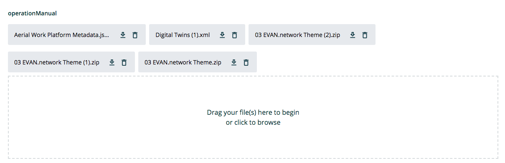

==================
FileInputComponent
==================

.. list-table:: 
   :widths: auto
   :stub-columns: 1

   * - Source
     - `files <https://github.com/evannetwork/ui-dapps/tree/master/dapps/evancore.vue.libs/src/components/forms/files>`__
   * - Extends
     - `EvanFormControl <./form-control.html>`_
   * - Selector
     - ``evan-file-input``

Wrapper for HTML 5 file upload. Uses the `ui-core File <../../../core/ui.libs/js/files.html>`__ utils, load load, return and format files to handle the correct format.

#. ``hovered`` - ``boolean``: is dropzone hovered?

Props
=====

#. ``accept`` - ``string``: input accept options
#. ``value`` - ``Array<FileHandler.UIContainerFile>``: All selected files
#. ``name`` - ``string``: Name of the input
#. ``placeholder`` - ``string``: Empty text that shown, when no files are uploaded and the component is not disabled.
#. ``emptyText`` - ``string``: Empty text that shown, when no files are uploaded and the component is disabled.
#. ``disabled`` - ``boolean``: Disable drag & drop and the upload button

Example
=======
- `Reference Implementation <https://github.com/evannetwork/ui-dapps/blob/master/dapps/digital-twin.data-container/src/components/create/create.vue>`__

.. code-block:: html

  

    <label for="value"
      v-if="standalone"
      :class="{'d-block': !oneLine, }">
      {{ label | translate }}
    </label>
    

      <evan-file-input
        :id="id" ref="value"
        :class="{ 'is-invalid' : control._error }"
        v-model="control.value.files"
        @input="control.setDirty(); control.value = control.value;">
      </evan-file-input>
      

        {{ control._error === true ? (`_datacontainer.ajv.value.error` | translate) : control._error }}
      

    

  

View Example
============

