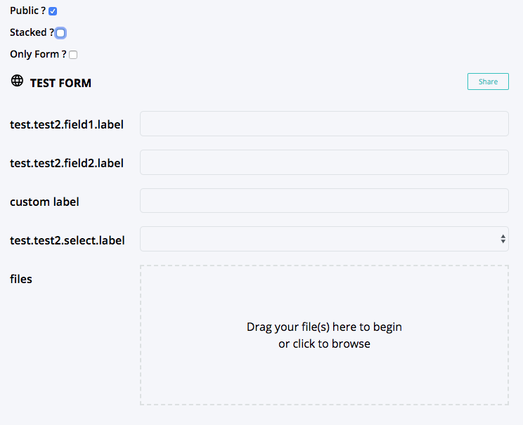
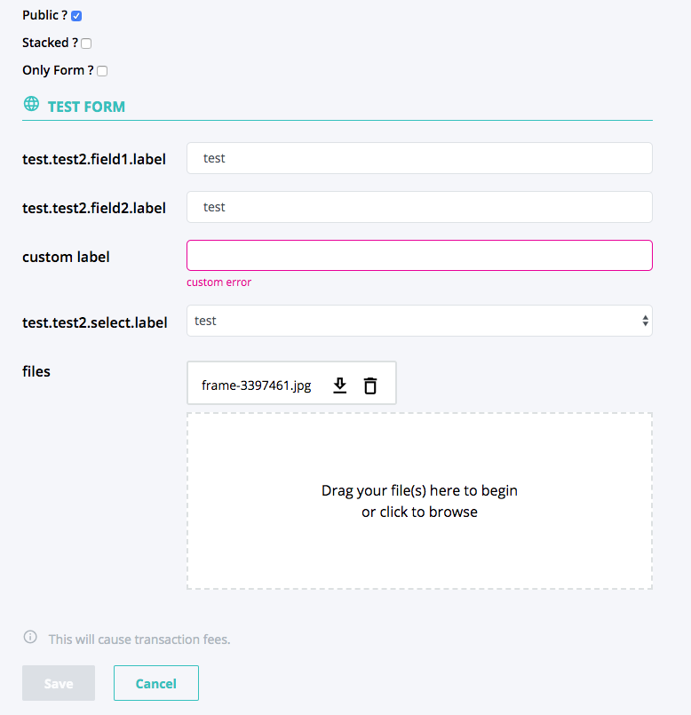
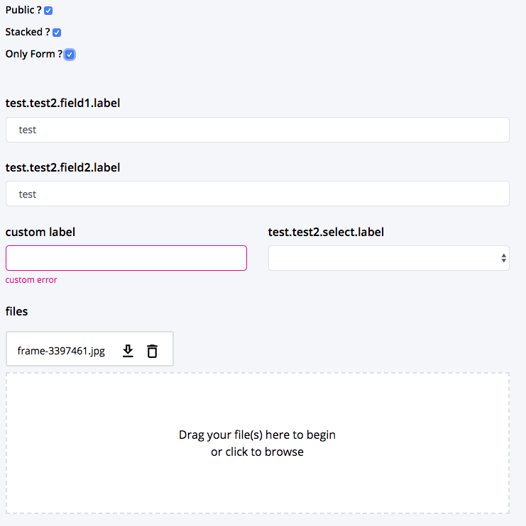

=================
EvanFormComponent
=================

.. list-table:: 
   :widths: auto
   :stub-columns: 1

   * - Source
     - `forms <https://github.com/evannetwork/ui-dapps/tree/master/dapps/evancore.vue.libs/src/components/forms/forms>`__
   * - Selector
     - ``evan-form``

Wrapper for evan.network formular handling. Includes a editMode that grays out included input fields when disabled and a scope detection icon (public / private). Child controls can trigger the parent formular to enable the editMode. Also it contains |source EvanForm|_ and |source EvanFormControl|_ support to automatically generate vue templates from typescript definition using `EvanFormComponent <./form.html>`__ and `EvanFormControlComponent <./form-control.html>`__.

#. ``editMode`` - ``boolean``: is editMode enabled?

save
cancel
getTranslation
getControlComponentName

--------------------------------------------------------------------------------

.. _form_setEditMode:

setEditMode
================================================================================

.. code-block:: typescript

  $refs.form.setEditMode(active);

Set the current edit mode. If |source EvanForm|_ was specified, create a form data backup, so the data can be resetted on cancel. 

----------
Parameters
----------

#. ``active`` - ``boolean``: path that should be navigated to

--------------------------------------------------------------------------------

.. _form_save:

save
================================================================================

.. code-block:: typescript

  $refs.form.save(ev);

Trigger the save function and wait for resolve.

----------
Parameters
----------

#. ``ev`` - ``Event``: save event args

--------------------------------------------------------------------------------

.. _form_cancel:

cancel
================================================================================

.. code-block:: typescript

  $refs.form.cancel(ev);

Cancel edit and send the corresponding event

----------
Parameters
----------

#. ``ev`` - ``Event``: event args to send

--------------------------------------------------------------------------------

.. _form_getTranslation:

getTranslation
================================================================================

.. code-block:: typescript

  $refs.form.getTranslation();

Return the translation for a control specific text (label, placeholder, error).

----------
Parameters
----------

#. ``control`` - |source EvanFormControl|_: control that should be translated
#. ``type`` - ``string``: text that should be translated (label, placeholder, error)

--------------------------------------------------------------------------------

.. _form_getControlComponentName:

getControlComponentName
================================================================================

.. code-block:: typescript

  $refs.form.getControlComponentName();

Get the form-data type component string for a control.

----------
Parameters
----------

#. ``control`` - |source EvanFormControl|_: control that should be translated

Props
=====
#. ``title`` - ``string``: Form title that is displayed at the top of the formular
#. ``isPublic`` - ``boolean``: Is the formular data public or protected? Will switch the top left security indicator icon.
#. ``isLoading`` - ``boolean``: Show the loading symbol and disable the accept button.
#. ``disabled`` - ``boolean``: Disable the save button.
#. ``form`` - |source EvanForm|_: Optional evan formular, that will automatically generate slot content formular. For custom forms just overwrite the full content slot, or each generated field slot.
#. ``i18nScope`` - ``string``: If the evan form is used to generate automatic inputs, all the input titles, descriptions and errors will be translated using this i18n scope.
#. ``stacked`` - ``boolean``: Display inputs with labels in oneline or stacked.
#. ``onlyForm`` - ``boolean``: Render only the formular without adding the formular wrapper. (title, isPublic, isLoading, disabled does not take any effect)

Send Events
===========

#. ``save``: trigger when Clicking save button or by submitting the form
#. ``cancel``: triggered when canceling the editMode

Slots
=====
#. ``default``: by using the default slot, the complete automatic generated formular will be disabled and custom formular can be specified
#. ``control-${ name }``: each control that is defined within the |source EvanForm|_ can be overwritten with the specific slot (e.g. ``<template v-slot:form-control-files>``)

Example
=======
- `Reference Implementation <https://github.com/evannetwork/ui-dapps/blob/master/dapps/components.vue/components/forms>`__

.. code-block:: ts

  interface SampleFormInterface extends EvanForm {
    field1: string;
    field2: string;
    field3: number;
    select: string;
    files: any;
  }

  this.sampleForm = new EvanForm(this, {
    field1: {
      value: '',
    },
    field2: {
      value: '',
      validate: function(vueInstance: Forms, form: SampleFormInterface) {
        return this.value.length !== 0;
      },
    },
    field3: {
      value: '',
      validate: function(vueInstance: Forms, form: SampleFormInterface) {
        return this.value.length !== 0;
      },
      uiSpecs: {
        type: 'input',
        attr: {
          error: 'custom error',
          label: 'custom label',
          placeholder: 'custom placeholder',
          type: 'number',
          size: 6
        }
      }
    },
    select: {
      value: '',
      validate: function(vueInstance: Forms, form: SampleFormInterface) {
        return this.value.length !== 0;
      },
      uiSpecs: {
        type: 'select',
        attr: {
          options: this.options,
          size: 6,
        }
      }
    },
    files: {
      value: [ ],
      validate: function(vueInstance: Forms, form: SampleFormInterface) {
        return this.value.length !== 0;
      }
    },
  }) as SampleFormInterface;

.. code-block:: html

  <evan-form
    ref="sampleForm"
    :form="sampleForm"
    :i18nScope="'test.test2'"
    :isPublic="isPublic"
    :onlyForm="onlyForm"
    :stacked="stacked"
    :title="'Wurstbasar'"
    @save="handleSubmit">
    <template v-slot:form-control-files>
      <evan-file-input
        label="files"
        v-model="sampleForm.files.value"
        :stacked="stacked"
        @input="$refs.sampleForm.setEditMode(true);">
      </evan-file-input>
    </template>
  </evan-form>

View Example
============

.. |source EvanForm| replace:: ``EvanForm``
.. _source EvanForm: ../vue/ui-vue-core/evanForm.html

.. |source EvanFormControl| replace:: ``EvanFormControl``
.. _source EvanFormControl: ../vue/ui-vue-core/formControl.html