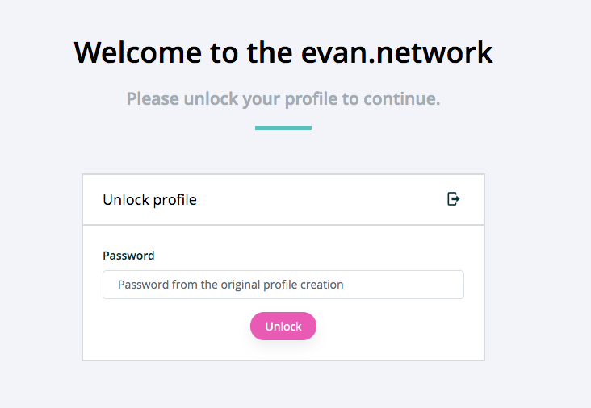

==============
LoginComponent
==============

.. list-table:: 
   :widths: auto
   :stub-columns: 1

   * - Source
     - `login <https://github.com/evannetwork/ui-dapps/tree/master/dapps/evancore.vue.libs/src/components/login>`__
   * - Selector
     - ``evan-login``

Handles the password input of a user and checks, if it's correct and it's profile can be encrypted with that password. Used by the dapp-wrapper to login the current user if needed. Will send an `logged-in` event including the users provided password.

**Only for development**: Add the ``evan-test-password`` to your localStorage with the password of your account and the UI will login automatically.

#. ``accountId`` - ``string``: active account id
#. ``checkingPassword`` - ``boolean``: is the current mnemonic / password is currently checking?
#. ``form`` - ``any``: form for the password
  #. ``password`` - ``any``: current password input
    #. ``value`` - ``string``: current password value
    #. ``valid`` - ``boolean``: is the password valid
    #. ``dirty`` - ``boolean``: password was touched?
    #. ``ref`` - ``any``: input reference

Events
=====

#. ``logged-in``: Is triggered when the user has inserted his password and the password was correct.

Example
=======
- `Reference Implementation <https://github.com/evannetwork/ui-dapps/tree/master/dapps/evancore.vue.libs/src/components/dapp-wrapper>`__

.. code-block:: html

  <evan-login
    v-on:logged-in="login($event)">
  </evan-login>

View Example
============

