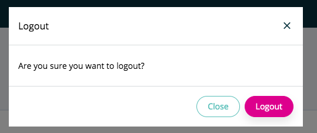

===============
LogoutComponent
===============

.. list-table:: 
   :widths: auto
   :stub-columns: 1

   * - Source
     - `logout <https://github.com/evannetwork/ui-vue/tree/master/dapps/evancore.vue.libs/src/components/logout>`__
   * - Selector
     - ``evan-logout``

Handles user logout. Directly provides a button, that triggers a logout accept modal. Logs out the user, if modal gets accepted. Optionally, the button can be disabled and the modal can be triggered using vue refs.

Props
=====

#. ``disableButton`` - ``boolean``: disable the logout button

--------------------------------------------------------------------------------

.. _logout_logout:

logout
================================================================================

.. code-block:: typescript

  $refs.logoutComp.logout();

Show the logout modal and ask for logging out

--------------------------------------------------------------------------------

.. _logout_runLogout:

runLogout
================================================================================

.. code-block:: typescript

  $refs.logoutComp.runLogout();

Logs out the user.

--------------------------------------------------------------------------------

Example
=======
- logout

  .. code-block:: html

    <evan-logout></evan-logout>

- custom button within a EvanDropdown

  .. code-block:: html

    <evan-dropdown ref="userDropdown"
      :alignment="'right'"
      :width="'300px'">
      <template v-slot:content>
        

          <a class="dropdown-item py-2"
            @click="$refs.evanLogout.logout()">
            {{ '_evan.logout' | translate }}
          </a>
        

      </template>
    </evan-dropdown>

- typescript logout

  .. code-block:: typescript
  
    import * as dappBrowser from '@evan.network/ui-dapp-browser';

    dappBrowser.core.logout();

View Example
============

