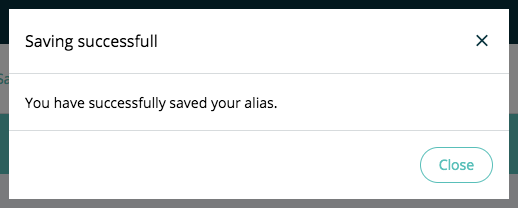

==============
ModalComponent
==============

.. list-table:: 
   :widths: auto
   :stub-columns: 1

   * - Source
     - `modal <https://github.com/evannetwork/ui-vue/tree/master/dapps/evancore.vue.libs/src/components/modal>`__
   * - Selector
     - ``evan-modal``
   * - style
     -  `breadcrumbs <../../../core/ui.libs/styling/modal.html>`__

Bootstrap modal wrapper in evan custom design. Content of the modal can be set by seperated vue slots. Always a close button and a backdrop is provided to close the modal. For custom close button, enable the ``customModal`` property.

#. ``isRendered`` - ``string``: shows the dom elements of the modal
#. ``isShown`` - ``string``: animate the modal

Props
=====

#. ``customModal`` - ``string``: Removes the normal content containers and enables the ``<slot name="content" v-if="customModal"></slot>`` slot.
#. ``maxWidth`` - ``string``: Configurable modal width
#. ``modalClasses`` - ``Array<string>`` (default: modal-header, modal-body, modal-footer) :Enable or disable evna specific modal part classes. E.g. by removing the modal-header class, the header will loose it's style, so you can use usal html & css withou evan design.

Events
======

#. ``close``: Triggered when modal was closed

.. _modal_show:

show
================================================================================

.. code-block:: typescript

  $refs.modalComp.show();

Show the modal.

.. _modal_hide:

hide
================================================================================

.. code-block:: typescript

  $refs.modalComp.hide();

Hide the modal.

--------------------------------------------------------------------------------

Example
=======
- `Reference Implementation <https://github.com/evannetwork/ui-core-dapps/blob/develop/dapps/addressbook.vue/src/components/add/add.vue>`__

- normal modal

  .. code-block:: html

    <evan-modal
      ref="acceptModal">
      <template v-slot:header>
        <h5 class="modal-title">
          {{ `accept.title` | translate }}
        </h5>
      </template>
      <template v-slot:body>
        

        

      </template>
      <template v-slot:footer>
        <button type="button" class="btn btn-primary btn-rounded">
          {{ `accept.action` | translate }}
          <i class="mdi mdi-arrow-right label"></i>
        </button>
      </template>
    </evan-modal>
  
- custom modal

  .. code-block:: html
  
    <evan-modal ref="acceptModal"
      :customModal="true">
      <template v-slot:content>
        

          <h3>{{ `accept.title` | translate }}</h3>
          <button class="btn p-0"
            @click="$refs.acceptModal.hide()">
            <i class="mdi mdi-close"></i>
          </button>
        

        

          

          

        

        

          <button type="button" class="btn btn-outline-secondary btn-rounded"
            @click="$refs.acceptModal.hide();">
            {{ '_evan.cancel' | translate }}
          </button>
          <button type="button" class="btn btn-primary btn-rounded">
            {{ `accept.action` | translate }}
            <i class="mdi mdi-arrow-right label"></i>
          </button>
        

      </template>
    </evan-modal>

View Example
============

