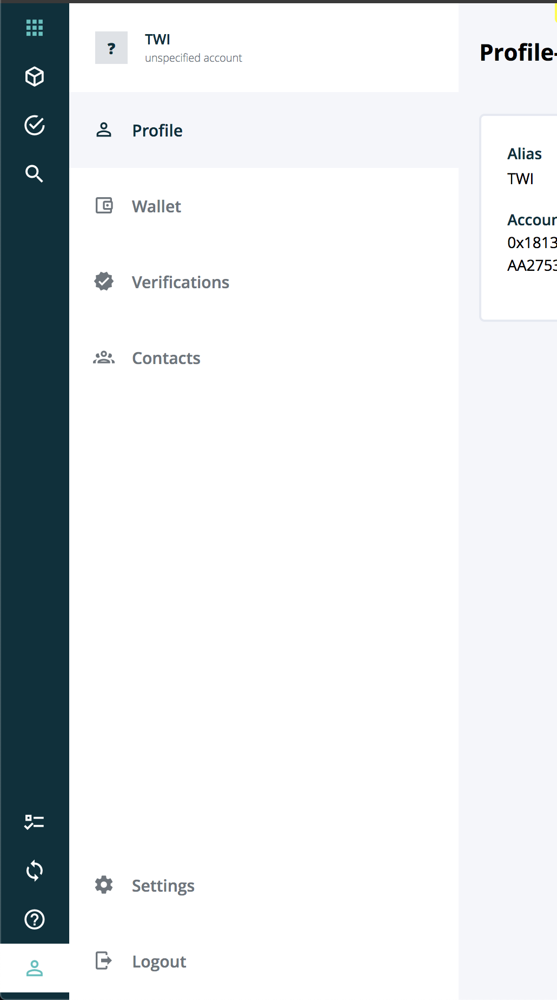

================
NavListComponent
================

.. list-table:: 
   :widths: auto
   :stub-columns: 1

   * - Source
     - `nav-list <https://github.com/evannetwork/ui-vue/tree/master/dapps/evancore.vue.libs/src/components/nav-list>`__
   * - Selector
     - ``evan-nav-list``
   * - style
     -  `nav-list <../../../core/ui.libs/styling/nav-list.html>`__

DApp-wrapper-level-2 optimized navigation list component for building list navigations using the `nav-list <https://github.com/evannetwork/ui-core/tree/master/dapps/ui.libs/src/style/nav-list.scss>`__ and a vue router integration for checking active and activating list entries.

#. ``activeEntry`` - ``number``: currently active list entry

--------------------------------------------------------------------------------

.. _navList_EntryInterface:

EntryInterface
================================================================================

Parameter definition for the list entries

----------
Parameters
----------

#. ``href`` - ``string``: Url that should be opened
#. ``id`` - ``string`` (optional): Optional id that is added as tab id selector
#. ``icon`` - ``string`` (optional): Optional icon class, that will be passed into a `i` element
#. ``text`` - ``string``: i18n translation key
#. ``action`` - ``Function``: function that should be called on the list entry click

-------
Example
-------
- Reference Implementation: `Profile DApp <https://github.com/evannetwork/ui-core-dapps/tree/develop/dapps/profile.vue/src/components/root>`_

.. code-block:: js

  this.navEntries = [
      { key: 'github', icon: 'mdi mdi-github-circle' },
      { key: 'bccdocs', icon: 'mdi mdi-server-security' },
      { key: 'uidocs', icon: 'mdi mdi-format-color-fill' },
    ]
    .map(entry => (entry ? {
      id: `nav-entry-${ entry.key }`,
      href: `${ (<any>this).dapp.fullUrl }/${ entry.key }`,
      text: `_help.docs.${ entry.key }`,
      icon: entry.icon,
    } : null));

.. code-block:: html

  <evan-dapp-wrapper-level-2>
    

      <evan-nav-list :entries="navEntries"></evan-nav-list>
    

  </evan-dapp-wrapper-level-2>

View Example
============

