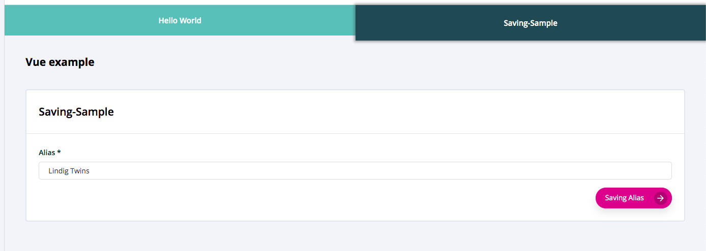

================
NavTabsComponent
================

.. list-table:: 
   :widths: auto
   :stub-columns: 1

   * - Source
     - `breadcrumbs <https://github.com/evannetwork/ui-vue/tree/master/dapps/evancore.vue.libs/src/components/breadcrumbs>`__
   * - Selector
     - ``evan-nav-tabs``
   * - style
     -  `breadcrumbs <../../../core/ui.libs/styling/tabs.html>`__

Displays tabs in evan.network design using vue router integration for checking active and activating tabs.

#. ``activeTab`` - ``number``: currently active tab

--------------------------------------------------------------------------------

.. _navTabs_TabInterface:

TabInterface
================================================================================

Parameter definition for the tab entries.

----------
Parameters
----------

#. ``color`` - ``string`` (optional): Custom color code that overwrites evan defaults
#. ``href`` - ``string``: Url that should be opened
#. ``id`` - ``string`` (optional): Optional id that is added as tab id selector
#. ``text`` - ``string``: i18n translation key

--------------------------------------------------------------------------------

Props
=====

#. ``tabs`` - ``TabInterface``: List of tabs that should be displayed

Example
=======
- `Reference Implementation <https://github.com/evannetwork/ui-core-dapps/tree/develop/dapps/mailbox.vue/src/components/root>`__

- typescript

  .. code-block:: typescript

    this.tabs = [ 'helloworld', 'dispatcher', ]
      .map(urlKey => ({
        id: `tab-${ urlKey }`,
        href: `${ (<any>this).dapp.fullUrl }/${ urlKey }`,
        text: `_sample.breadcrumbs.${ urlKey }`
      }));

- html

  .. code-block:: html

    <evan-nav-tabs class="flex-shrink-0"
      :tabs="tabs"
      ref="navTabs">
    </evan-nav-tabs>

View Example
============

