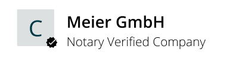

=======================
ProfilePreviewComponent
=======================

.. list-table:: 
   :widths: auto
   :stub-columns: 1

   * - Source
     - `profile-preview <https://github.com/evannetwork/ui-vue/blob/master/dapps/evancore.vue.libs/src/components/profile-preview/profile-preview.vue>`__
   * - Selector
     - ``evan-profile-preview``

Displays a user information according to it's evan.network profile type.

#. ``loading`` - ``boolean``: indicates that the component loads data
#. ``userInfo`` - ``any``: currents user information (alias, type, ...)

Props
=====

#. ``address`` - ``string``: Address for that the profile preview should be displayed

Example
=======
- `Reference Implementation <https://github.com/evannetwork/ui-vue/blob/master/dapps/evancore.vue.libs/src/components/nav-list/nav-list.vue>`__

.. code-block:: html

  <evan-profile-preview
    :address="$store.state.runtime.activeAccount">
  </evan-profile-preview>

--------------------------------------------------------------------------------

View Example
============

