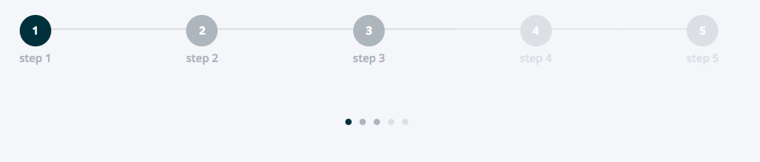

==============
StepsComponent
==============

.. list-table:: 
   :widths: auto
   :stub-columns: 1

   * - Source
     - `steps <https://github.com/evannetwork/ui-dapps/blob/master/dapps/evancore.vue.libs/src/components/steps/steps.vue>`__
   * - Selector
     - ``evan-steps``

Displays a step organized ui.

Props
=====

#. ``activeStep`` - ``number``: activeStep defines the current outlined step
#. ``steps`` - ``Array<Step>``: The steps array, with the shape of Step interface ({ title: String, disabled: boolean })
#. ``minimal`` - ``boolean``: Use a minimal design and show only small step indicators.

Example
=======
- `Reference Implementation <https://github.com/evannetwork/ui-dapps/tree/develop/dapps/components.vue/src/components/steps/stepst.vue>`__

.. code-block:: html

  <evan-steps
    :activeStep="0"
    :minimal="false"
    :steps="[
      { title: 'step 1', disabled: false, },
      { title: 'step 2', disabled: false, },
      { title: 'step 3', disabled: false, },
      { title: 'step 4', disabled: true, },
      { title: 'step 5', disabled: true, },
    ]" />

--------------------------------------------------------------------------------

View Example
============

