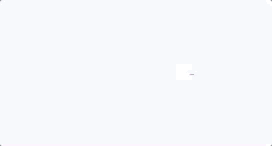

================
SuccessComponent
================

.. list-table:: 
   :widths: auto
   :stub-columns: 1

   * - Source
     - `success <https://github.com/evannetwork/ui-vue/tree/master/dapps/evancore.vue.libs/src/components/success>`__
   * - Selector
     - ``evan-success``

Shows a animated "check" icon.

Example
=======
- `Reference Implementation <https://github.com/evannetwork/ui-core-dapps/blob/develop/dapps/onboarding.vue/src/components/accept-contact/accept-contact.vue>`__

.. code-block:: html

  <evan-success></evan-success>

View Example
============

