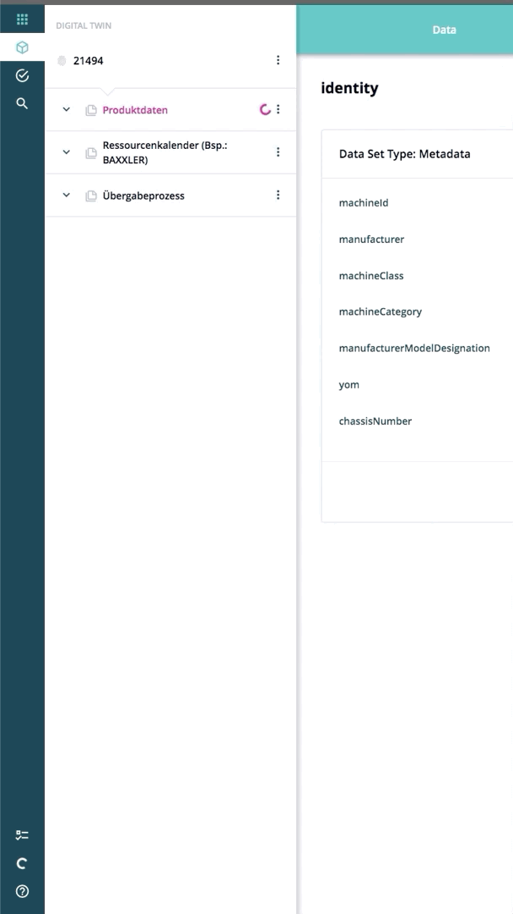

===================
SwipePanelComponent
===================

.. list-table:: 
   :widths: auto
   :stub-columns: 1

   * - Source
     - `swipe-panel <https://github.com/evannetwork/ui-vue/tree/master/dapps/evancore.vue.libs/src/components/swipe-panel>`__
   * - Selector
     - ``evan-swipe-panel``

A swipe panel design for displaying context sensetive content that swipes in.s

#. ``isRendered`` - ``boolean``: shows the dom elements of the swipe panel
#. ``isShown`` - ``boolean``: animate the swipe in

Props
=====

#. ``width`` - ``string`` (default: 400px): Width of the sidepanel (will be 100% beneath 768px screen size)
#. ``alignment`` - ``string`` (default: left, right): defines the swipe side

Events
======

#. ``close``: Triggered when sipePanel was closed

.. _swipepanel_show:

show
================================================================================

.. code-block:: typescript

  $refs.sipePanelComp.show();

Show the swipepanel.

.. _swipepanel_hide:

hide
================================================================================

.. code-block:: typescript

  $refs.sipePanelComp.hide();

Hide the sipePanel.

--------------------------------------------------------------------------------

Example
=======
- `Reference Implementation <https://github.com/evannetwork/ui-vue/blob/develop/dapps/evancore.vue.libs/src/components/dapp-wrapper/dapp-wrapper.vue>`__

.. code-block:: html

  <evan-swipe-panel
    :alignment="'left'">
  </evan-swipe-panel></>

View Example
============

