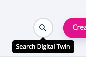

================
TooltipComponent
================

.. list-table:: 
   :widths: auto
   :stub-columns: 1

   * - Source
     - `tooltip <https://github.com/evannetwork/ui-dapps/tree/master/dapps/evancore.vue.libs/src/components/tooltip>`__
   * - Selector
     - ``evan-tooltip``
   * - style
     -  `breadcrumbs <../../../core/ui.libs/styling/tooltip.html>`__

Bootstrap tooltip wrapper.

#. ``showTooltip`` - ``boolean``: is the tooltip shown?

Props
=====

#. ``placement`` - ``string``: Tooltip placement (top, bottom, left, right)
#. ``delay`` - ``number``: Timeout in ms, until the tooltip gets shown
#. ``multiline`` - ``boolean``: Shows a multiline tooltip, without overflowing on max width

Example
=======
- `Reference Implementation <https://github.com/evannetwork/ui-dapps/blob/develop/dapps/digital-twins/src/components/twins/twins.vue>`__

.. code-block:: html

  <evan-tooltip :placement="'bottom'">
    {{ 'info' | translate }}
  </evan-tooltip>

------------
View Example
------------

