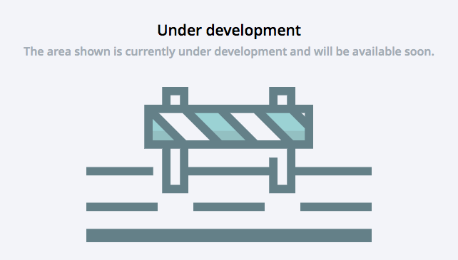

=========================
UnderDevelopmentComponent
=========================

.. list-table:: 
   :widths: auto
   :stub-columns: 1

   * - Source
     - `under-development <https://github.com/evannetwork/ui-dapps/tree/master/dapps/evancore.vue.libs/src/components/under-development>`__
   * - Selector
     - ``evan-under-development``

Shows a ``under-development`` placeholder for enabling empty routes with maintenance or something else.

Example
=======

.. code-block:: html

  <evan-under-development></evan-under-development>

View Example
============

